# Table of Contents
- [1. Set up the development environment💻](#1-set-up-the-development-environment)
  - [1.1 Development Environment for Windows Systems](#11-development-environment-for-windows-systems)
    - [1.1.1 Installation Steps for the Windows System Development Environment](#111-installation-steps-for-the-windows-system-development-environment)
    - [1.1.2 Problem Supplement](#112-problem-supplement)
      - [1.1.2.1 Cannot understand the interface/Garbled characters](#1121-cannot-understand-the-interfacegarbled-characters)
  - [1.2 Development Environment for Mac OS Systems](#12-development-environment-for-mac-os-systems)
    - [1.2.1 Installation Steps for the Mac System Development Environment](#121-installation-steps-for-the-mac-system-development-environment)
    - [1.2.2 Problem Supplement](#122-problem-supplement)
      - [1.2.2.1 The interface is not in one's native language](#1221-the-interface-is-not-in-ones-native-language)
    - [1.2.3 Recommendations for VS Code Plugins (Optional to Skip)](#123-recommendations-for-vs-code-plugins-optional-to-skip)
- [2. The Origin of the C Language](#2-the-origin-of-the-c-language)
- [3. The Function and Application Scope of the C Language](#3-the-function-and-application-scope-of-the-c-language)
  - [3.1 Function](#31-function)
  - [3.2 Application Scope](#32-application-scope)
- [4. Other](#4-other)
  - [4.1 About the Knowledge Framework of This Book](#41-about-the-knowledge-framework-of-this-book)
  - [4.2 The mindset for learning](#42-the-mindset-for-learning)
  - [4.3 References/Sources for This Article](#43-referencessources-for-this-article)

# 1. Set up the development environment💻

The first step in learning the C programming language is to set up a development environment that allows you to *write , compile, and run* C code, which serves as the foundation for subsequent learning.  

>Writing: Use a text editor[^1] and input code in accordance with the syntax rules of the C language[^2] to create a source file with the .c extension[^3]. This is a process of converting logic into code.

[^1]: A tool used for writing and modifying text content
[^2]: The coding standards and logical constraints specified by the C language
[^3]: A text file with the .c extension, such as test.c

>Compilation: The process of converting a C language source file into machine code that a computer can directly execute (an object file[^4]) through a compiler[^5].

[^4]: Also known as a binary file, it is a file generated by a compiler that contains machine code (instructions composed of 0s and 1s).==The only files that a computer can execute directly are binary files.==
[^5]: Tools that convert human-readable C language source files (in text format) into machine code recognizable by computers (in binary format) include GCC, Clang, etc. In layman's terms, this process is like "translation".

>Execution(run): Run the executable file generated by compilation[^6], allowing the program to actually execute on the computer and output results. The execution process is the final manifestation of the program's logic.

[^6]: A file that can run directly in an operating system. In Windows systems, it has the .exe extension (e.g., test.exe), while in Linux/Mac systems, it has no fixed extension.

Below, I will introduce how to set up the environment for Windows/Mac systems. Please select the corresponding section to read based on your own system📖

_The reason for choosing these two is that they are the main computer systems purchased by beginners._

## 1.1 Development Environment for Windows Systems

It is recommended to use DEV C++, as it features simple installation and an intuitive interface. It is very suitable as a development environment for beginners to write C/C++ code✅

### 1.1.1 Installation Steps for the Windows System Development Environment

The following are the steps

 1.  Click this link[DEV C++](https://sourceforge.net/projects/orwelldevcpp/)to navigate to the new website.
 2.  Click the green "Download" button on the interface (click the part I circled with a red box).
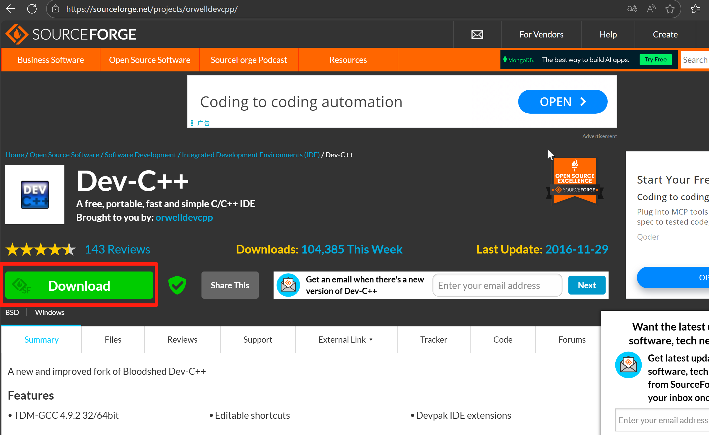
 3.  Wait for a few seconds, and a download pop-up like this will appear in the upper right corner of your browser⬇️（If you don’t see it, please click the area I circled with a red circle.）

 4.  After the download is complete, click the folder 📁 icon
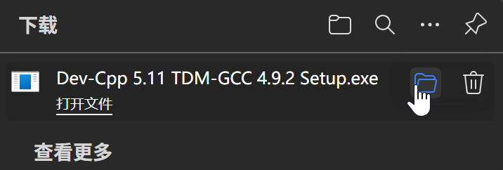
 5. Right-click with the mouse 🖱️, and select "Run as administrator"
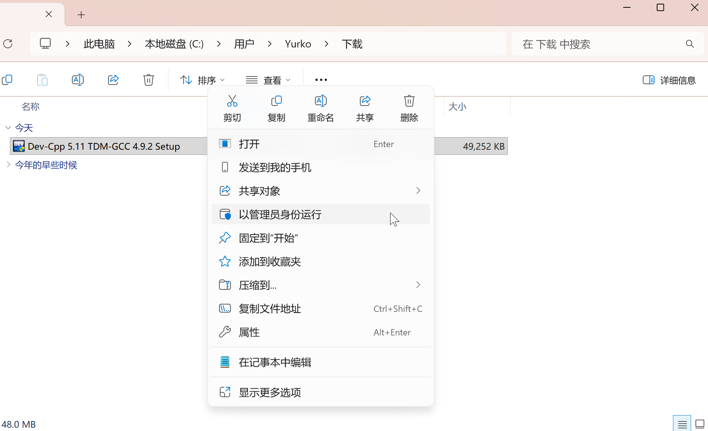
 6. Agree to this operation (click the "Yes" button)

 7. After waiting for the download to complete, when the window shown in the second image appears, click the "OK" button

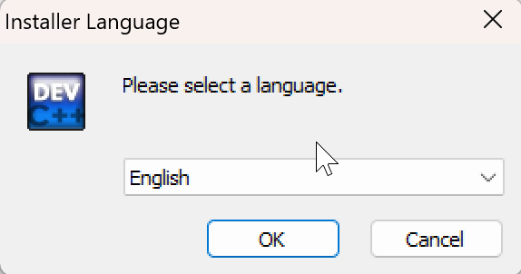
 8. This is the software installation license agreement interface; click the "I Agree" button below

 9. Just go with the default settings and click the "Next" button

 10. At this step, you need to select the installation path. The default installation path is on the C drive. (If you need to install it elsewhere, click the "Browse" button in the red box to choose the installation path.) Then click the "Install" button to start the installation
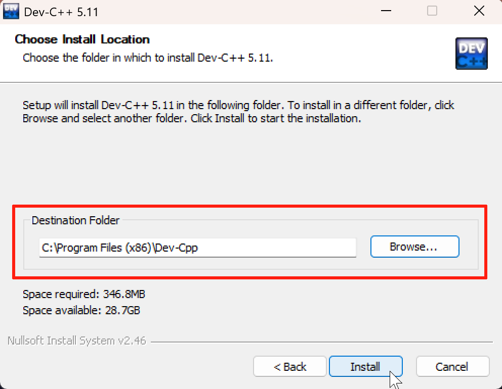
 11. After waiting for the progress bar to finish the installation, click the "Finish" button.

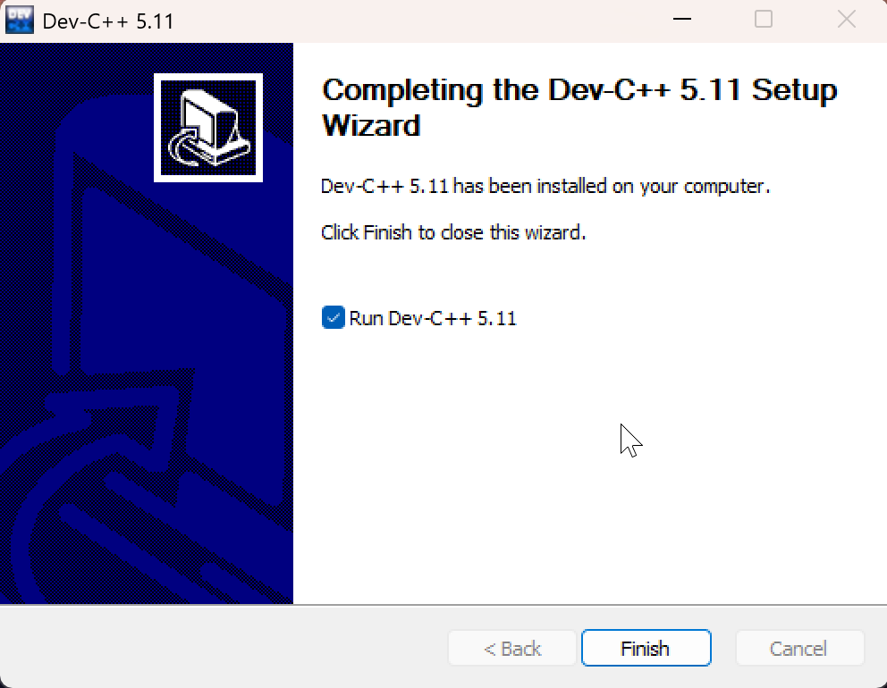
 12. This step is the module for selecting the interface language. After confirming it is correct, click the "Next" button

 13. This step is for selecting the interface style, which refers to its appearance. You can choose the default option and click the "Next" button
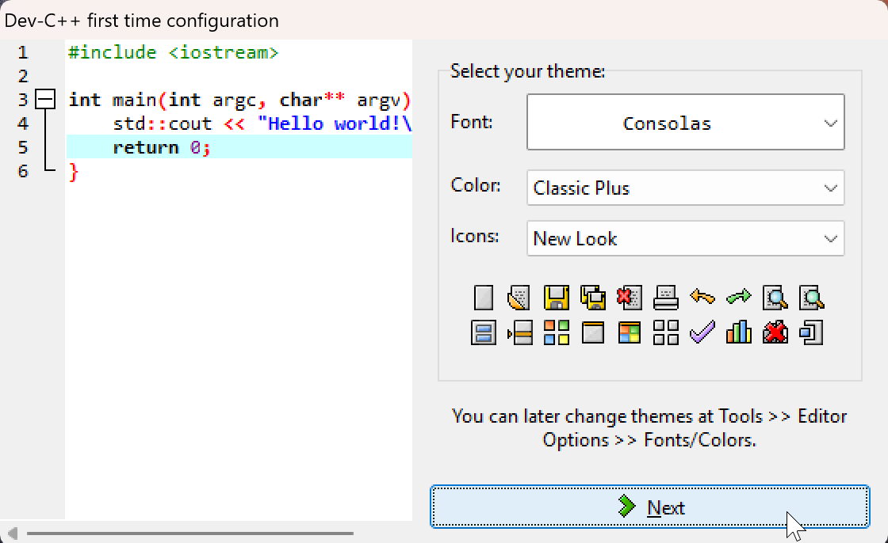
 14. Wait for this interface to appear; this indicates that the installation has been completed ✅. Congratulations on finishing the environment configuration under Windows 🎉.

### 1.1.2 Problem Supplement

Welcome to supplement the problems you encountered in the comment section; I will add them here later.

#### 1.1.2.1 Cannot understand the interface/Garbled characters

 1. The problem usually occurs in Step 12 mentioned above. On the interface, select "TOOLS" (the fourth from the bottom, at the position circled in red), then click "Environment Options" (the second one from top to bottom in the pop-up window).

 2. After opening it, select your language in the third "Language" option on the right side (for those who can't understand the interface, just count the third one on the right). Once selected, click the "OK" button below, and the entire interface will update to your chosen language.

If the above method fails to solve the problem, uninstall the program and then reinstall it by following the steps.

## 1.2 Development Environment for Mac OS Systems

Although Apple has a dedicated IDE (Integrated Development Environment)[^7], namely Xcode, I do not recommend using this software for development. It is more suitable for developing software based on the Mac system.

[^7]: Integrated Development Environment (IDE) is a type of software application that provides developers with a unified development environment. It encompasses the functions required for a series of development processes, such as code writing, compilation, debugging, and testing.

Here, I recommend VSCode (Visual Studio Code) for beginners. It has a small installation size and comes with a rich plugin library✅

### 1.2.1 Installation Steps for the Mac System Development Environment

The following are the steps

 1.  Click this link [VSCode](https://code.visualstudio.com) to access the new website. At the beginning, there will be a prompt about Cookies; just select "Accept".
 2. Click the white "Download for macOS" button on the interface (click the part I circled with a red box).
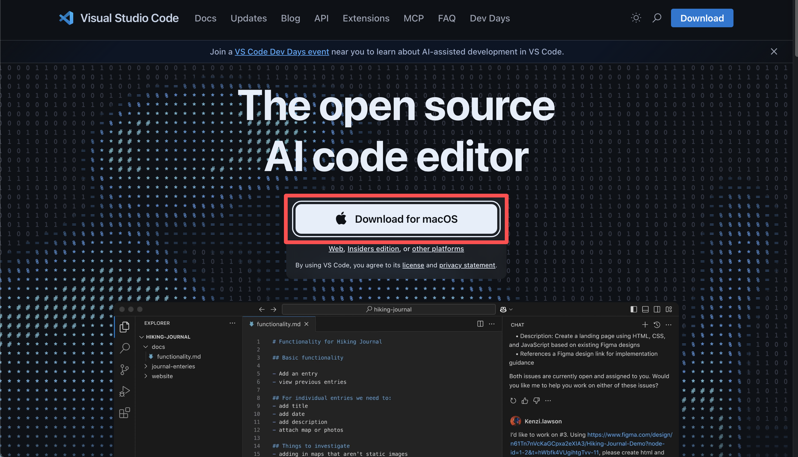
 3. Wait for the browser to finish downloading, and double-click the installation package once the download is complete.

 4. Once the download is complete, the system will pop up a prompt asking whether to open the file; just select "Open".

 5. This is the software download. There are additional notes below (Step 6 can be skipped).

 6. Open Finder and move the software from the Downloads folder to the Applications folder (move it to the area circled in red).
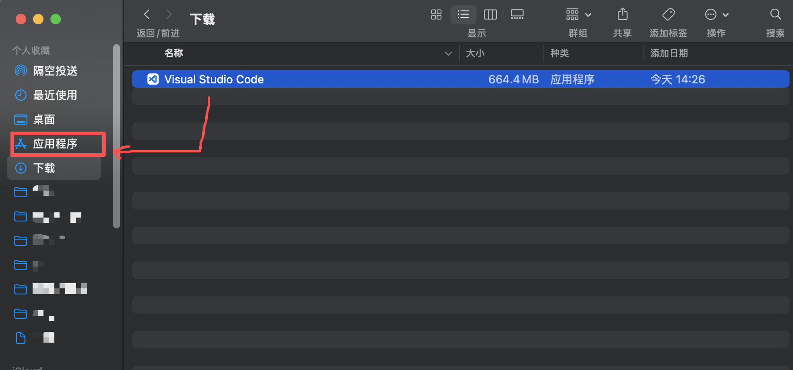
 7. Open the software, click the last "Extensions" option on the left sidebar, search for "@category:debuggers C", select the first result, and click "Install". This step is to add C/C++ language development support to VS Code.
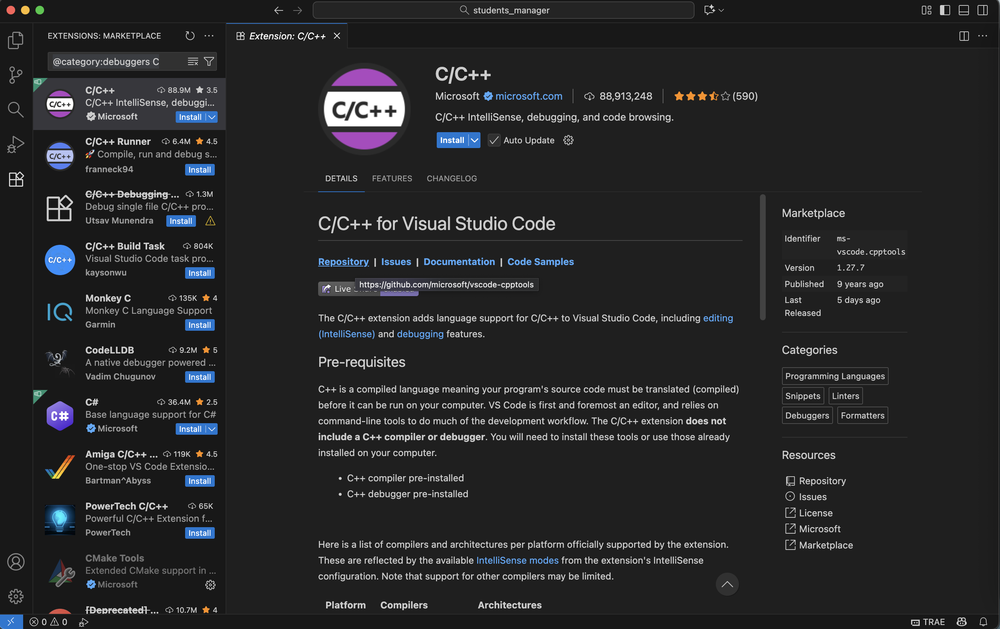
 8. After the download is complete, you will see a page like this. Congratulations on finishing the environment configuration on Mac 🎉

 
### 1.2.2 Problem Supplement

#### 1.2.2.1 The interface is not in one's native language

Since VSCode is in English by default, if you need the interface in another language, you will need to install a language extension for that specific language (we will use Chinese as an example here)

 1. Search for 🔍 "chinese" in Extensions, select the first result, and click "Install".

 2. After the download is complete, a window as shown in the image below will pop up in the lower right corner. Click the button; then the software will restart, and once the restart is finished, the interface will be in Chinese.

### 1.2.3 Recommendations for VS Code Plugins (Optional to Skip)
 
 - C/C++ Extension Pack (a development extension pack launched by Microsoft) and C/C++ Themes (provides UI themes)

 
 Here are a few that I commonly use. They make reading code more comfortable and are mainly used for enhancing the appearance⬇️
 - indent-rainbow（can intuitively see line breaks.）

 - Bracket Pair Color DLW(it helps distinguish between different parentheses and define hierarchy in complex programs.)
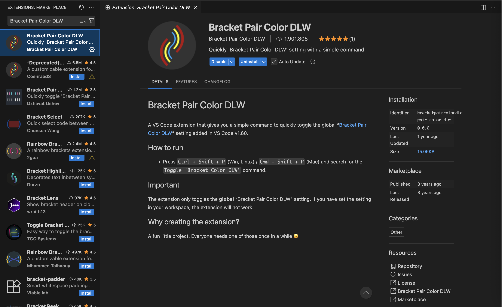

You can also add some commonly used extensions for writing C language programs in the comment section🧩

# 2. The Origin of the C Language

The C language was developed by Dennis Ritchie at Bell Laboratory in the 1970s.

It evolved from the B language[^8], with its initial design goal being to develop the UNIX operating system[^9].

[^8]:It is a high-level language designed in 1970 by Kenneth Lane Thompson, an employee of Bell Laboratories, based on BCPL (Basic Combined Programming Language).
[^9]:It is a multi-user and multi-tasking computer operating system, originally developed by Bell Laboratories.

Before the advent of the C language, system-level programming relied heavily on assembly language, which featured *low development efficiency and poor portability.*

> Development efficiency: Refers to the speed and quality of completing the writing, debugging, and maintenance of code for specific functions.

> High portability: Refers to the ability of a program to run normally on different operating systems (such as Windows, Linux, macOS) or hardware architectures (such as x86, ARM) without modification or with only minor modifications.

When developing the C language, Dennis Ritchie balanced expressiveness and execution efficiency, enabling the C language to not only directly manipulate hardware resources (such as memory) but also be relatively easily portable across different computer architectures.

# 3. The Function and Application Scope of the C Language

## 3.1 Function

The C language is a programming language[^10] close to the low-level and has the following key roles/functions.

[^10]:A programming language is a tool used for communication between humans and computers. It defines a set of rules and syntax for writing instructions that computers can understand and execute. There are three generations of programming languages: the first-generation machine language, the second-generation assembly language, and the third-generation high-level language. The C language belongs to the third generation.

 - Direct hardware manipulation: It can directly access memory addresses and operate registers, enabling efficient control of computer hardware resources.
 - High execution efficiency: The machine code generated by compilation has execution efficiency close to that of assembly language, making it suitable for scenarios with strict performance requirements (such as game engines and database kernels).
 - It lays the foundation for learning other languages and the study of data structures in the future.

## 3.2 Application Scope 

What can we do after learning the C language❓

 - Game Development: A large number of game engines (such as the underlying rendering module of Unity and the core logic of UE) use the C language extensively to improve performance.🎮🔝
 -  Industrial Software: Control software for automated production lines, embedded programs in the aerospace field, and other such applications often use the C language for development due to strict requirements for reliability and performance.
 -  Embedded Systems: The firmware development of smartwatches ⌚️, smart home devices, and industrial control equipment (such as PLCs) relies on the C language.
 - Operating System Development: A large number of core modules in the kernels of UNIX, Linux, and Windows are written using the C language.
 - Databases and Middleware: The core modules of databases (such as MySQL 📊) and caching systems (such as Redis) are implemented using the C language, which ensures high performance in data processing.
 - Device Drivers: Drivers for hardware such as graphics cards, sound cards, and network cards are mostly developed using the C language, as it can interact directly with hardware registers.

Therefore, the C language is very common in our daily lives. During the process of learning the C language, we will also engage in the practice of some projects to achieve the unity of knowledge and action.

***The C language course emphasizes the parallel development of practice and theory.***

# 4. Other

## 4.1 About the Knowledge Framework of This Book

Every subsequent chapter will follow the same structure as this one. However, during the learning process, I will use both text and images to explain concepts as much as possible.

Don't worry if your mathematical and logical foundations are not strong. I will supplement relevant mathematical knowledge points and logical concepts in each article.

I will also provide supplementary explanations for some proper nouns. If you don't recognize any words, you can also raise your questions in the comment section.

It is still being updated, with two articles per week, and I will actively respond to relevant questions in the comment section.

This is a C language learning course that even complete beginners can get started with.

## 4.2 The mindset for learning

No matter what mood or purpose you (the reader) have for learning the C language—whether it is for work, for exams, or out of interest—I hope all of you can acquire knowledge, and I have always firmly believed that:

>  __Technology always serves humanity__

No matter what language or what new high-tech product it is, all of these are for the service of humanity. They are all tools of humankind.

Therefore,* please do not feel excessively confused or lost while learning.* These are all products of human wisdom. It is okay if you do not understand them immediately—after all, not everyone can drive a car as soon as they get in one 🚗

The human spirit, will, and creativity are boundless ∞. I cannot use my poor imagination to judge what the future of humanity will be like or what the future of the world will be like. However, the development of science and technology will inevitably serve humanity.

## 4.3 References/Sources for This Article

 -  Stephen Prata. C Primer Plus（6th Edition）[M].
 - All images are from screenshots taken on my computer

