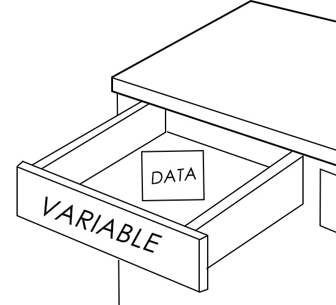
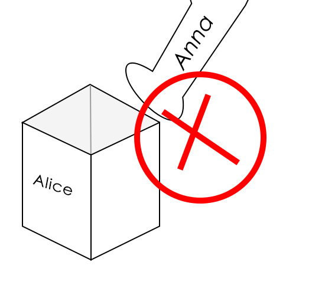
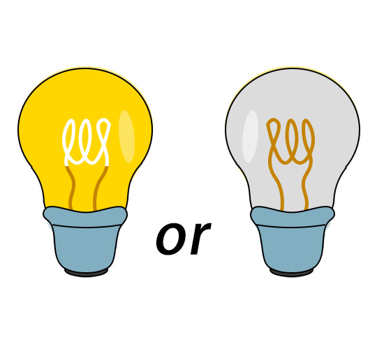

# Table of Contents
- [1. Variable Declaration](#1-variable-declaration)
  - [1.1 Definition and Naming Rules of Variables](#11-definition-and-naming-rules-of-variables)
  - [1.2 Initialization of Variables](#12-initialization-of-variables)
  - [1.3 Basic Concepts of Variable Scope](#13-basic-concepts-of-variable-scope)
    - [1.3.1 Local Variable](#131-local-variable)
    - [1.3.2 Global Variable](#132-global-variable)
- [2. Data Type](#2-data-type)
  - [2.1 Integer Type](#21-integer-type)
  - [2.2 Floating-Point Type](#22-floating-point-type)
  - [2.3 Character Type](#23-character-type)
    - [2.3.1 ASCII Code](#231-ascii-code)
- [3. Other](#3-other)
  - [3.1 Computer Storage Units](#31-computer-storage-units)
    - [3.1.1 Smallest unit: Bit](#311-smallest-unit-bit)
    - [3.1.2 Basic unit: Byte](#312-basic-unit-byte)
    - [3.1.3 Operating unit: Word](#313-operating-unit-word)
  - [3.2 References/Sources for This Article](#32-referencessources-for-this-article)

# 1. Variable Declaration

Variables are the basic units for storing data in the C programming language.


A variable is like a drawer for organizing items in your home. Each drawer (variable) has a name and a type, and it is used to store different things (data) 📄.

##  1.1 Definition and Naming Rules of Variables

The definition of a variable requires explicitly specifying its type and name.

> [Type] [Variable Name]

Type refers to the attribute of the data 📊 you store.

==All variables must be declared before use.==

==Please note that when writing a complete statement in the C programming language, do not forget to add a semicolon (in English input mode) at the end.==



It's like looking for someone in a crowd—you need to know the person's name first to find them 🗣️

The variable naming in the C programming language must follow the following rules:

 - It consists of letters, numbers, and underscores, and must start with a letter or an underscore.
 - Case sensitivity must be distinguished; for example, "Alice" and "alice" are two different variables.
 - You cannot use the "keywords" of the C programming language as variable names.

| Keyword Type |There are a total of 32 keywords (so far). |
|--|--|
|  Data Type Keywords| char、short、int、long、float、double、unsigned、signed、void、struct、union、enum |
|  Control Statement Keywords | if、else、for、while、do、switch、case、default、break、continue、goto、return |
|  Storage Class Keywords | auto、register、static、extern、const |
| Other Keywords | sizeof、typedef、volatile |

For example, define an integer variable for storing age:

```c
int age;
```

The line above defines a variable named "age"—in other words, we now have an empty drawer named "age" 🗃️


##  1.2 Initialization of Variables

Initializing a variable means assigning an initial value to it.

初始化变量可以直接在声明中完成，只需在变量名后面加上* 赋值运算符（=）*和待赋给变量的值即可。
Variable initialization can be done directly in the declaration—you only need to add the * assignment operator(=)  * and the value to be assigned to the variable after the variable name.


- Basic Assignment Operator=：Store the result of the expression on the right side into the variable on the left side; in other words, assign the value (derived from the right-side expression) to the left-side variable.

The common methods of variable initialization are as follows⬇️

```c
int age = 18;
```


That is to say, a note with "18" written on it is placed in the drawer named "age". Since it is a drawer, naturally the data here can be more than just 18—it can also be 19 or 20.

But the first note we put in is the number 18, so variable initialization is like "putting the first item into the drawer".

The above is the initialization of a simple single variable. Since there is a space🏠 for storing items , we can have many spaces to store different things.⬇️

```c
int money = 100,save = 200;
```


##  1.3 Basic Concepts of Variable Scope

The scope of a variable sounds like a very abstract concept; in fact, the scope of a variable can be understood as its visible range 👀

It means where you can see your "box" 🗃️

###  1.3.1 Local Variable

As mentioned above, we placed a note with "18" written on it in the drawer named "age", and the drawer is located in the bedroom. Then our scope is within the bedroom 🛏️.

This is called a local variable  —a variable that can only be used within a specific region.

A local variable can be used within a specific scope of a program, but cannot be used outside this scope—because the entire variable only functions within that scope.



> This is Alice's storage box, and Anna cannot use it.

In a class, everyone has their own storage box. The ownership (scope) of this storage box (variable) belongs to the student themselves, not other classmates.

###  1.3.2 Global Variable

The opposite of a local variable is a global variable.


> This is the class's public bookshelf, so Amy and Anna can borrow books from it.

Still in the context of a class, the class's public bookshelf 📖 can be used by everyone in the class to borrow books. That is to say, within the entire class (program), anyone can access the public books (global variables).

A global variable is a variable that can be accessed within the entire scope of a program.

In future programming exercises, we will introduce the differences and usage of these two in detail; here, we only explain them as basic concepts.

# 2. Data Type

C language classifies data into different "types," just like people who like to organize items tend to categorize their belongings and place them in different locations.

Data types are used to store different types of data, and the following are three basic data types.

##  2.1 Integer Type

The integer type is used to store integers.

| Integer Type | Introduction |
|--|--|
| int | Basic integer type, usually occupying 4 bytes. |
| short（or short int） | Short integer type, occupying 2 bytes.|
| long(or long int） | Long integer type, occupying 4 or 8 bytes |
| long long（or long long int） | Long long integer type, occupying 8 bytes |

A byte is the basic unit for a computer to store and process data, and I will provide an introduction on this aspect in Section 3.1 of this article.

```c
int a = 10;
```

A basic integer variable named a is defined, and the value of a is 10.

##  2.2 Floating-Point Type

The floating-point type, also known as the real type, is used to store numerical values with decimals.

| Floating-point type (real type) | Introduction |
|--|--|
| float | Single-precision floating-point type, which occupies 4 bytes and has a precision of approximately 6-7 significant digits. |
| double | Double-precision floating-point type, which occupies 8 bytes and has a precision of approximately 15-17 significant digits. |

In most cases, using double allows for higher precision, enabling the data we calculate to be more accurate.

```c
double pi = 3.1415926;
```

A double-precision floating-point variable named pi is defined, and the value of pi is 3.1415926.

##  2.3 Character Type

The character type char is used to store a single character and occupies 1 byte.

It can store not only a single character but also small integers.

```c
char ch = 'A';
char num = 65;	// it is num = 'A';
```

==If you want to assign A to ch, you need to add single quotes (in English input mode).==

*The small integers mentioned here are not true integers, but ASCII values. Therefore, 65 and 'A' here have the same meaning, both representing the uppercase letter A.*

###  2.3.1 ASCII Code

Let's have a simple understanding of computers.⬇️

A light has two states: on and off.



Therefore, electronic components have two states: on and off, which are represented by the numbers 0 and 1 in digital form. Computers are composed of a huge number of electronic components.

Therefore, computers can directly perform calculations related to 0 and 1, which means such calculations can be directly executed by the machine.

However, in today's society, our lives involve not only numbers but also characters and other types of data. Therefore, the American standards organization developed the ASCII encoding, which specifies which binary numbers are used to represent common symbols.

Since number systems can be converted into each other, binary can be converted to decimal (we use decimal in our mathematical calculations), and decimal can similarly be converted to binary.。

| Decimal | Binary | ASCII Code(character / meaning) | Classification Description |
|--|--|--|--|
|0|00000000|NUL（bull character)|Control character, used to identify whitespace|
|8|00001000|BS（Backspace key)|Control character, moves the cursor one position to the left|
|9|00001001|TAB（Tab key）|Control character, which makes the cursor tab|
|10|00001010|LF（Enter key）|Control character, which moves the cursor to a new line|
|13|00001101|CR（Carriage Return key）|Control character, which moves the cursor to the start of the current line |
|32|00100000|	（Space character）|Displayable character, blank space|
|48|00110000|0（number 0）|Displayable character, the starting point of digits 0-9|
|49|00110001|1（number 1）|Displayable character, numeric series|	
|...|...	…|（digits 2-9）|Decimal values 48-57 correspond to the digits 0-9|	
|65|	01000001	|A（uppercase letter A）|Displayable character, the starting point of uppercase letters|
|66|	01000010|	B（uppercase letter B）|Displayable character, uppercase letter series |
|...	|...	…|（uppercase letters C-Z）|Decimal values 65-90 correspond to uppercase letters A-Z |
|97|	01100001|	a（lowercase letter a）|Displayable character, the starting point of lowercase letter |
|98|	01100010|	b（lowercase letter b）|Displayable character, lowercase letter series |
|...|	...	…|（lowercase letters c-z）|Decimal values 97-122 correspond to lowercase letters a-z |
|33|	00100001	|!（exclamation mark）|	Displayable character,punctuation marks|
|64|	01000000	|@（@At Sign）|Displayable character,special symbols |
|127|	01111111|	DEL（Delete character）| Control character, used for deletion operations|

⬆️These are the common ASCII code values. In the next article, I will cover the mutual conversion and calculation between binary and decimal. This can be used as a reference for your learning.

# 3. Other

Here, we only provide explanations for traditional computers and general-purpose computers, and will not discuss other types.

##  3.1 Computer Storage Units

From the above learning about ASCII codes, we have understood that what computers can directly comprehend is binary, which corresponds to the two states of electronic components: on (current-carrying) and off (non-current-carrying).

###  3.1.1 Smallest unit: Bit

The smallest data unit in a computer is a "bit", which can only represent two states: 0 or 1.

In the computing process, a bit is usually denoted by "bit".

All data in a computer will eventually be broken down into bit combinations of "0" and "1".

###  3.1.2 Basic unit: Byte

The byte is the most commonly used basic storage unit in computers, and 1 byte is generally abbreviated as 1B.

The conversion relationship between bytes and bits is as follows⬇️

1 Byte=8 bit.

 *Since bytes themselves are relatively small, larger units are used in practical applications. Their conversion factor is 1024, which is 2^10^ 。*

- 1KB（Kilobyte） = 1024B
- 1MB（ Megabyte）= 1024KB
- 1GB（Gigabyte） = 1024MB
- 1TB（Terabyte）= 1024GB

###  3.1.3 Operating unit: Word

A "word" refers to the length of data that a computer can process at one time. Its size is not fixed and depends on the computer's "word length" (e.g., 32-bit computers, 64-bit computers). The number of bytes corresponding to one word equals the word length (i.e., 1 word = [word length]-bit bytes).

The "word" reflects a computer's computing capability. The longer the word length, the more data the computer can process at one time, and its computing speed is usually faster.

Example🌰
- 32-bit computer: Word length = 32 bits, 1 word = 4 bytes (32 ÷ 8 = 4), and it can process 4 bytes of data at a time 📊
- 64-bit computer: Word length = 64 bits, 1 word = 8 bytes (64 ÷ 8 = 8), and it can process 8 bytes of data at a time 📊

##  3.2 References/Sources for This Article

 - Kernighan, B., & Ritchie, D. The C Programming Language (2nd Edition)[M].

 -  Stephen Prata. C Primer Plus（6th Edition）[M].

 - he picture was hand-drawn by myself✍️
