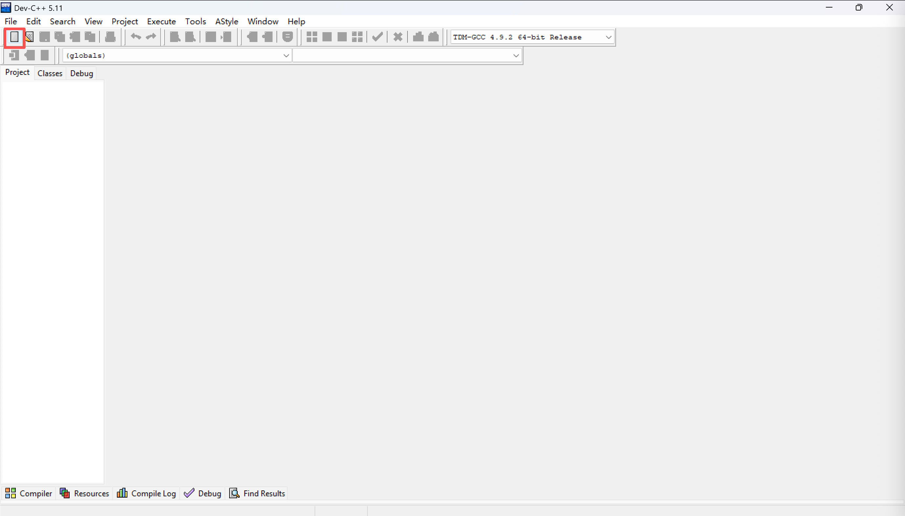
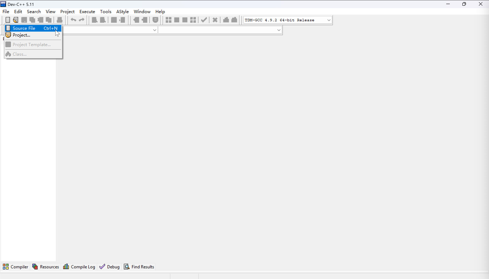
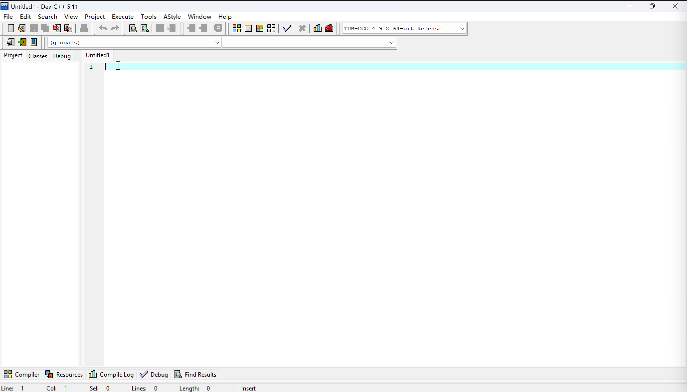
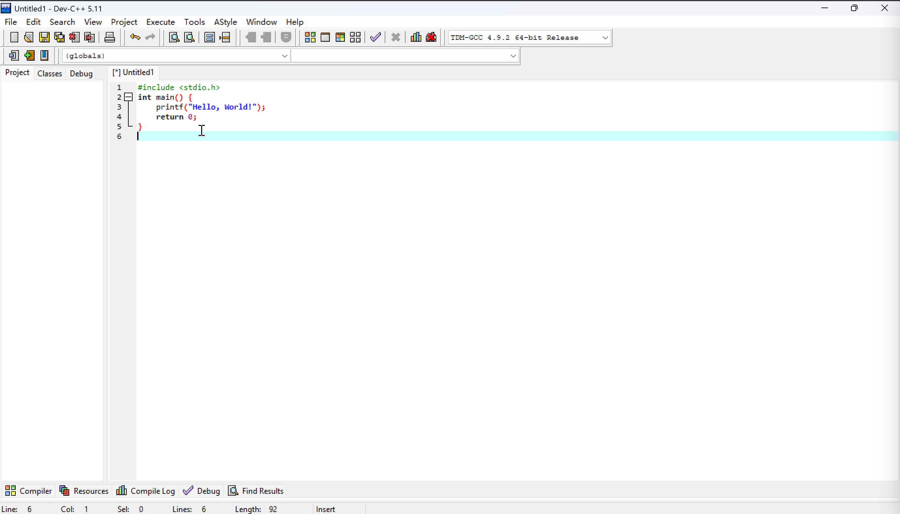
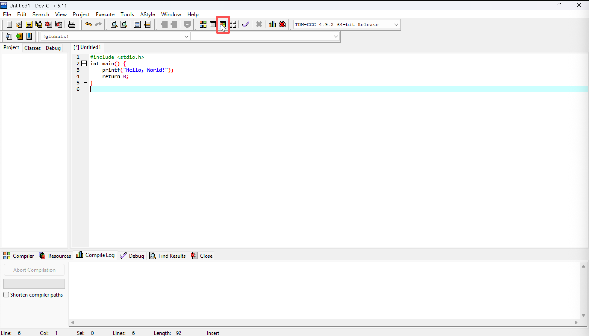
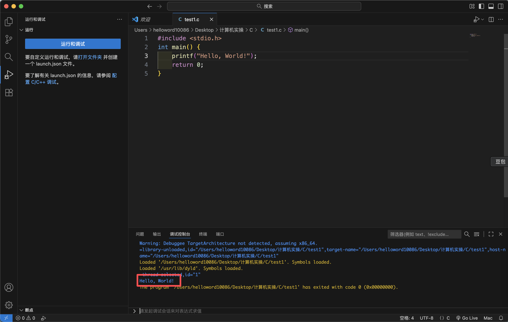

# Table of Contents
- [1. Operator](#1-operator)
  - [1.1 Arithmetic Operator](#11-arithmetic-operator)
    - [1.1.1 Integer Division](#111-integer-division)
    - [1.1.2 Floating-point Division](#112-floating-point-division)
  - [1.2 Relational Operator](#12-relational-operator)
  - [1.3 Logical Operator](#13-logical-operator)
    - [1.3.1 Logical AND](#131-logical-and)
    - [1.3.2 Logical OR](#132-logical-or)
    - [1.3.3 Logical NOT](#133-logical-not)
    - [1.3.4 Precedence and Associativity of Logical Operators](#134-precedence-and-associativity-of-logical-operators)
- [2. Basic Strategies for C Programming](#2-basic-strategies-for-c-programming)
  - [2.1 Process Related to the Execution of C Programs](#21-process-related-to-the-execution-of-c-programs)
  - [2.2 The First C Program](#22-the-first-c-program)
    - [2.2.1 HelloWorld!](#221-helloworld)
    - [2.2.2 How to Run on Windows](#222-how-to-run-on-windows)
    - [2.2.3 How to Run on Mac](#223-how-to-run-on-mac)
- [3. Other](#3-other)
  - [3.1 References/Sources for This Article](#31-references-sources-for-this-article)

# 1. Operator

Operators are basic syntax elements in the C language that implement data operations, and they can be divided into three categories by function: arithmetic, relational, and logical.

##  1.1 Arithmetic Operator

Arithmetic operators are used for numerical calculations and include the following types⬇️

| Arithmetic operators  | Mathematical meaning |
|--|--|
| + |Addition, used to calculate the result of addition |
| - | Subtraction, used to calculate the result of subtraction |
| * | Multiplication, used to calculate the result of multiplication |
| / | Division, used to calculate the result of division |
| % | Modulo, used to calculate the remainder after division |

Please note the following points:

 - ➗In division operations, if all operands are integers, the result is an integer (with the decimal part truncated); if there are floating-point operands, the result is a floating-point type.
 > ·Operand: a quantity involved in an operation, which is the object acted upon by an operator.

### 1.1.1 Integer Division

There are 5 apples in total and 2 children. How to divide (the apples) so that it is fair? (The apples cannot be cut to give to the children.)


Let's perform a simple division calculation. Of course, we can figure it out by mental arithmetic here. One child gets two apples, naturally🍎


```c
int apples = 5,kids=2,each;
each = apples/kids;	
//the result of "each" here is 2
```
If it is expressed in C language code, it is written like this⬆️

 ### 1.1.2 Floating-point Division
 
Here we have a whole pizza, and we need to divide it between the two children above. At the moment, however, we have a knife 🔪 with us (representing a floating-point number, which allows the appearance of decimals).


Therefore, each child can get half of the pizza, which is 0.5 portions of pizza 🍕

```c
float pizza = 1.0,each;
each = pizza/kids;
//the result here is a floating-point number 0.5
```
If it is expressed in C language code, it is written like this⬆️

 - The modulo operation applies only to integers, and the sign of the result is the same as that of the dividend.
 
Going back to our earlier example of dividing apples 🍎, after 4 apples have been distributed among the children, only one apple remains.


```c
int apples = 5,kids=2,remain;
remain = apples%kids;
//the result of “remain” here is 2
```
It is written like this when expressed in C language code⬆️

*The variable names I use here look a bit complicated, but replacing them with a, b, c would have the same effect. It's fine as long as you can understand them!*

Addition, subtraction, and multiplication are used in much the same way; you just need to replace the operator with the corresponding one. 

##  1.2 Relational Operator

Relational operators are used to compare the relationships between operands.

For the judgment of a relationship, there are two possible results: true (the relationship holds) and false (the relationship does not hold).

In the C programming language, we return boolean values to represent the result of such a relational judgment as true (1) or false (0).

Relational operators include the following six types⬇️

| Relational operators | example | explanation |
|--|--|--|
| == |  a==b | when a is equal to b, it returns true; otherwise, it returns false |
| != |  a!=b | when a is not equal to b, it returns true; otherwise, it returns false |
| > | a>b | when a is greater than b, it returns true; otherwise, it returns false |
| < | a<b | when a is less than b, it returns true; otherwise, it returns false |
| >= | a>=b | when a is greater than or equal to b, it returns true; otherwise, it returns false |
| <= | a<=b | when a is less than or equal to b, it returns true; otherwise, it returns false |

It is worth noting that == can be used not only for basic data types but also for reference data types.

> ·Reference data type: A data type represented by a reference to the actual value of the type. This will be covered when we learn about this part later.

##  1.3 Logical Operator

Logical operators are used to perform basic logical operations.

Logical operators combine or modify boolean values (true/false). They take the truth or falsity of expressions as operands and ultimately return a boolean value.

| Logical operators | Format | Description |
|--|--|--|
| &&（logical AND） |  ExpressionA && ExpressionB | when the results of both expressions are true, the overall result is true; otherwise, it is false |
| ｜｜（logical OR） | ExpressionA｜｜ExpressionB | when either Expression A or Expression B is true, the overall result is true; only when both expressions are false, the overall result is false |
| ! （logical NOT）| !ExpressionA | Negate the result of Expression A: if A is true, the result is false; if A is false, the result is true |

⚠️The logical OR here should be ||; this is just for more intuitive display.

###  1.3.1 logical AND

```c
int a = 5, b = 10;
int result1 = (a > 0) && (b < 20); // true
int result2 = (a > 10) && (b < 20); // false
```
 - In result1:

The value of a is 5, which satisfies the expression a > 0, so the result of the left expression is true; the value of b is 10, which satisfies the expression b < 20, so the result of the right expression is true.

In logical AND, the overall result is true only when the results of the expressions on both sides are true.

 - In result2:

The value of a is 5, which does not satisfy the expression a > 10, so the result of the left expression is false; the value of b is 10, which satisfies the expression b < 20, so the result of the right expression is true.

In logical AND, if the results of the left and right expressions are one true and one false, the overall result is false.

###  1.3.2 logical OR

```c
int a = 5, b = 10;
int result1 = (a > 10) || (b < 20); // true
int result2 = (a > 10) || (b > 20); // false
```

 - In result1:

The value of a is 5, which does not satisfy the expression a > 10, so the result of the left expression is false; the value of b is 10, which satisfies the expression b < 20, so the result of the right expression is true.

In logical OR, if the results of the left and right expressions are one true and one false, the overall result is true.

 - In result2:

The value of a is 5, which does not satisfy the expression "a > 10", so the result of the left-hand expression is false; the value of b is 10, which does not satisfy the expression "b > 20", so the result of the right-hand expression is false.

In logical OR, if the results of the expressions on both the left and right sides are false, the overall result is false.

###  1.3.3 logical NOT

```c
int a = 5;
int result1 = !(a > 10); // true
int result2 = !(a > 0);  // false
```
 - In result1:

The value of a is 5, which does not satisfy the expression "a > 10", so the result of the expression "a > 10" is false.

In logical NOT, the result of the expression needs to be negated, so the result of NOT a is true.

 - In result2:

The value of a is 5, which satisfies the expression "a > 0", so the result of the expression "a > 0" is true.

In logical NOT, the result of the expression needs to be negated, so the result of NOT a is false.

###  1.3.4 Precedence and Associativity of Logical Operators

 - Priority: Logical NOT (!) > Arithmetic operators > Relational operators > Logical AND (&&) > Logical OR (||).
 - Associativity: Except for logical NOT (!), which is right-associative, both logical AND (&&) and logical OR (||) are left-associative.
 
#  2. Basic Strategies for C programming

After introducing so many basic syntax rules earlier, you might still have one question:

 *How exactly does the C language run❓*

This is an excellent question. Next, I will use a flow chart to demonstrate it:

##  2.1 Process Related to the Execution of C programs


> ·Linker: Integrates multiple code modules into a single executable complete program.

As can be seen from the figure above:

==For the C language, the introduction of library code is essential==

##  2.2 The First C program

Now let's learn about the first and most commonly used library, the standard input/output library.⬇️

> <stdio.>

This library contains output functions, input functions, and file operation functions.

In this section, we will first learn the most commonly used output functions⬇️

> printf('A');

This is a standard format. The content within single quotes will be output to the screen, which can be a string of characters, a single letter, or a single number.

###  2.2.1 HelloWorld！

In the C language, the most primitive and simplest framework is like this:

```c
#include <stdio.h> 
int main() {        
	// write your statements here.
    return 0;      
}
```

The content after // is a comment, and the content after // will not be executed when the program runs.

 - The first line is used to include the standard library of the C language, that is, to include the "standard input/output header file" (stdio.h)
 - The second line, `int main()`, is the entry function of the program. The C language stipulates that all programs must start executing from the `main` function, and the content within the curly braces `{ }` is the specific code to be executed by the function
 - The role of `return 0` is to indicate that the `main` function has finished executing and returns the integer 0 (signifying that the program ended normally), while a non-zero value indicates that the program ended abnormally.

*⚠️Note: The semicolon (;) at the end of a statement is the statement terminator. Many beginners tend to forget to add a semicolon at the end of a statement when writing code.*

Place the statements we want to write in the section I commented on; this will be our first program.💻

```c
#include <stdio.h>  
int main() {        
    printf("Hello, World!"); 
    return 0;      
}
```

###  2.2.2 How to run on Windows

The interface is in Chinese, but it doesn’t affect our operations—just follow my steps✅

 1. Open DEV C++, click on the part I circled, and select Source File


 2. Write the above code in the blank space of Figure 1; once written, it should look like Figure 2


 3. Click on the circled part in the figure (that is, the compile and run file)

 4. Choose an appropriate file storage location, name the file (e.g., test), and then save it

 5. Wait a moment (or click the run button again), and your terminal will pop up the window after running

"Hello, World!" in the figure is the content we wrote for the program. Congratulations on completing your first C language program🎉

###  2.2.3 How to run on Mac

 1. Open VSCode, create a new file (command + N), or select the method shown in the figure

 2. In the newly created file, enter the above code

 3. Click F5 on the keyboard, or find "Run" in the navigation bar (and select the content as shown in the figure)

 4. Choose a storage path, name the file, and save it.

 5. Choose an appropriate compiler; either one works (you need to install the extensions mentioned in my Article 0)

 6. Allow access to this file (it doesn't have to be the desktop; just allowing it is fine)

 7. In VSCode, the part I circled is the running result. Alternatively, if you want to check the running result in the terminal, please refer to steps 8 and 9

 8. Find the location where the file is stored (I deleted the previous files, leaving only the current one)

 9. Click the first terminal icon (if there is no icon, it may be a permission issue; just resolve it in the settings). The running result is as follows

"Hello, World!" in the figure is the content we wrote for the program. Congratulations on completing your first C language program🎉

#  3. Other

##  3.1 References/Sources for This Article

 - Stephen Prata. C Primer Plus（6th Edition）[M].
 - The picture was created by myself, either hand-drawn ✍️ or via computer screenshot.


