# Table of Contents
- [1. Program Control Structures](#1-program-control-structures)
  - [1.1 Sequential Structure](#11-sequential-structure)
  - [1.2 Selection Structure](#12-selection-structure)
    - [1.2.1 if-else statement](#121-if-else-statement)
    - [1.2.2 switch-case statement](#122-switch-case-statement)
  - [1.3 Loop Structure](#13-loop-structure)
    - [1.3.1 for loop](#131-for-loop)
    - [1.3.2 while loop](#132-while-loop)
    - [1.3.3 do-while loop](#133-do-while-loop)
    - [1.3.4 Termination and Skipping of Loops](#134-termination-and-skipping-of-loops)
- [2. A Brief Introduction to Flowcharts](#2-a-brief-introduction-to-flowcharts)
- [3. Other](#3-other)
  - [3.1 References/Sources for This Article](#31-referencessources-for-this-article)

# 1. Program Control Structures

During traffic jams or when roads are busy, we can often see traffic police directing traffic 🚥

In the C language, control structures take on the role of "traffic police" and are responsible for directing "traffic"—that is, directing the flow of program execution.

The control structures of the C language include sequential structures, selection structures, and loop structures. In the following sections, I will conduct in-depth explanations and discussions based on practical cases 📑

## 1.1 Sequential Structure

The sequential structure refers to statements that are executed in the order they are written.

Execution flow:
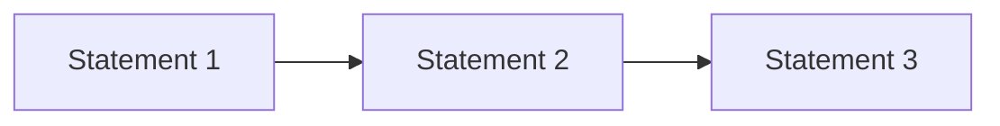
For example, such a calculation of the area of a rectangle is as follows ⬇️
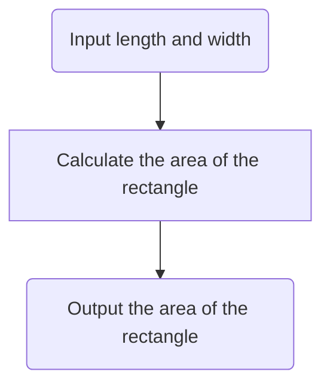
##  1.2 Selection Structure

The selection structure is branch execution based on conditions.

Depending on whether a certain condition is satisfied—i.e., based on the boolean value (true or false) of a certain condition—different branches are selected for execution.

###  1.2.1 if-else statement

 - **Single-branch if statement**
That is to judge a condition: if the condition is met (using if), the corresponding code block will be executed; if not, the code block will be skipped.

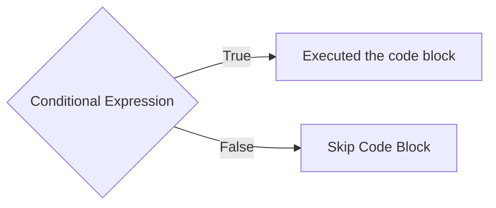

*A conditional expression can be either a variable or an expression.*

The syntax in the C language is as follows ⬇️

```c
if(Conditional Expression){
	// the code block executed when the conditional expression is true
}
```
In the C language, line breaks have no impact on the actual code. Therefore, it can also be expressed like this ⬇️
```c
if(Conditional Expression){}
```

The content enclosed in curly braces { } is the statement that the program needs to execute when the conditional expression is true.

During the writing process, choose the syntax that is more suitable for yourself to write ✍️

For example, judging whether a student's score is passing is expressed like this:


```c
int score = 65;
if(score >= 60){
	printf("Passed");
}
```
 - **Two-branch if-else statement**
Judge a condition: if the condition is true (using if), the corresponding statement for the true case will be executed; otherwise (using else), the corresponding statement for the false case will be executed.
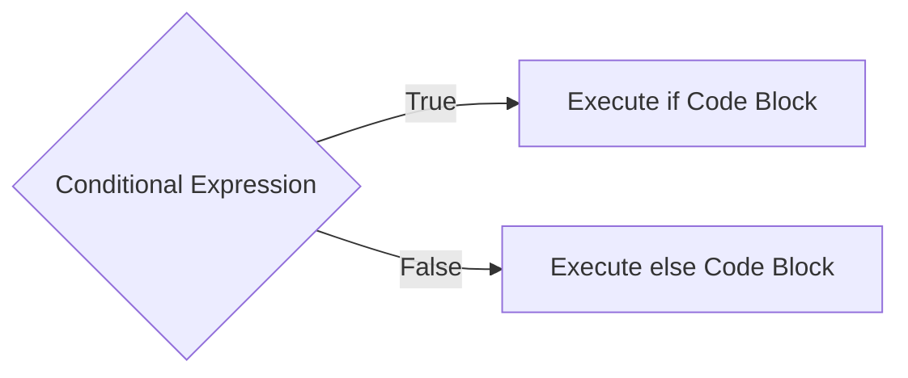

The syntax in the C language is as follows ⬇️

```c
if (conditional expression) {
    // Code executed when the condition is true
} else {
    // Code executed when the condition is false
}
```
For the above program used to judge scores, let's further enrich it ✨

```c
int score = 70;
if(score >= 60){
	printf("Passed");
}else{
	printf("Failed");
}
```
 - **Multi-branch if-else-if-else statement**
 A multi-branch statement is an extension of a two-branch statement, enabling it to judge three, four, or even more conditions.
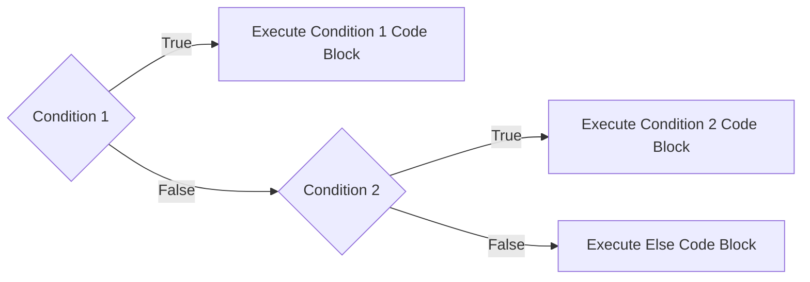
Therefore, if there are more conditions, it would be like this.
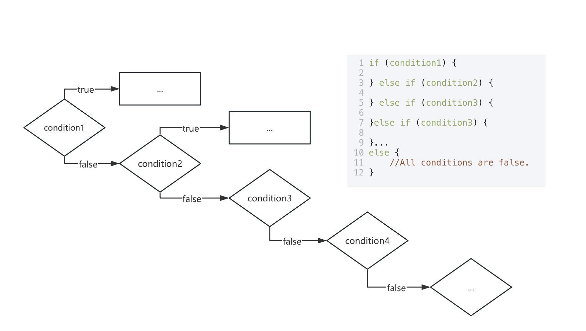

After going through so many conditional checks, the code block following else handles the scenario where all the preceding conditions are not met.

Therefore, the basic syntax is as follows ⬇️
```c
if (Condition 1) {
    // Executed when Condition 1 is true
} else if (Condition 2) {
    // Executed when Condition 2 is true
} ...
else {
    // Executed when all conditions are false
}
```
⚠️ It is worth noting that when using else if, it is applied only when the previous conditions are not met. Many people overlook this point, which is also the reason why some people encounter errors in the results returned by their programs.

Let us further refine the above program for score judgment (with a full score of 100 💯):

```c
int score = 75;
if(score >= 90){
	printf("Excellent");
}else if(score >= 80) {
	printf("Good");
}else if(score >= 60){
	printf("Passed");
}else{
	printf("Failed");
}
```
**Supplementary Matters**

 - Conditional expressions must be enclosed in parentheses ( )
 - If a code block contains only one statement, the curly braces { } can be omitted; however, it is recommended to include them for better code readability and to avoid code errors
 - In a multi-branch statement, if one of the conditional expressions is true, the subsequent branches will be skipped directly

###  1.2.2 switch-case statement

The switch-case statement is generally used to match multiple discrete values of a single variable, and it is more concise and efficient than the if-else statement.

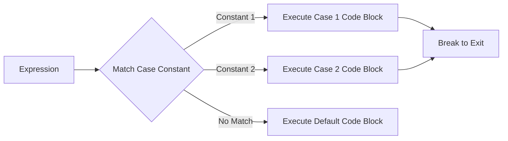

In other words, switch-case is used to execute specific statements for specific values.

Its syntax is as follows ⬇️

```c
switch(expression){
	case Constant 1;
		// the code executed when the expression equals constant 1
		break;  // exit the switch structure
	case Constant 2;
		//...
		break;
	...
	default;
		// the code executed when none of the case branches match.
}
```

break is used to "exit the current case". If break is omitted, the code of the next case will continue to be executed. Whether to omit it or not should be chosen according to actual requirements during use.

It may be quite hard to understand in real life, but it’s probably easy to get in the game ✅

When we are in a 6-player Werewolf game and casting votes to identify the culprit (votes are private, so you can vote for yourself), we can write it like this:

```c
int vote = 4;
switch(vote){
	case 1;
		printf("You voted for Candidate No. 1 ");
		break;
	case 2;
		printf("You voted for Candidate No. 2 ");
		break;
	case 3;
		printf("You voted for Candidate No. 3 ");
		break;
	case 4;
		printf("You voted for Candidate No. 4 ");
		break;
	case 5;
		printf("You voted for Candidate No. 5 ");
		break;
	case 6;
		printf("You voted for Candidate No. 6 ");
		break;
	default:
		printf("You choose to skip this round and not cast a vote.");
}
```
**Supplementary Matters**

 - The expression following switch must be of integer type or character type (e.g., int, char).
 - The constant following case must be a "literal constant" (e.g., 1, 'A'); the use of variables is not allowed.
 - The default is an optional branch, used to handle cases where none of the case branches match, similar to the else mentioned above.

##  1.3 Loop Structure

To put it simply, a loop structure is one that enables a program to execute a specific section of code repeatedly 🔁 until a certain condition is met.

###  1.3.1 for loop

The for loop is suitable for scenarios where "the number of loops is known", and its execution flow is shown in the figure below:

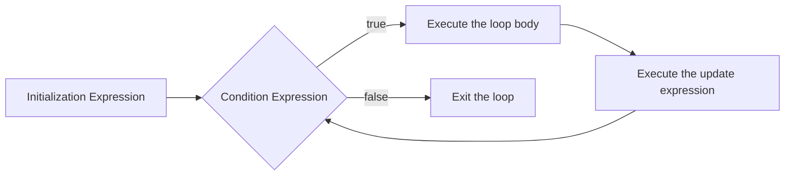
The basic syntax format is as follows ⬇️

```c
for ( Initialization Expression; Condition Expression; Update Expression){
	// Loop Body：the code that needs to be executed repeatedly
}
```
**Compound Assignment Operator**

Compound assignment operators are often used in for loops. Here, I will introduce compound assignment operators:

| Compound Assignment Operator | Example | Equivalent To |
|--|--|--|
| += | a += b | a = a+b |
| -= | a -= b | a = a-b |
| *= | a *= b | a = a*b |
| /= | a /= b | a = a / b |
| %= | a %= b | a = a % b |


**Increment, Decrement**

In addition to the compound assignment operators mentioned above, we often encounter increment or decrement in practical applications.

 - Increment ++ ：To increase the value of a variable by 1, which is equivalent to "variable = variable + 1"
 - Decrement -- ：To decrease the value of a variable by 1, which is equivalent to "variable = variable - 1"

Increment and decrement can be used as prefixes or suffixes. The difference lies in whether the value changes first (and is used later) or changes later (and is used first).

| Form | Execution Logic |
|--|--|
| ++a / --a | First perform the increment/decrement operation on the variable, and then use the new value of the variable to participate in the operation |
| a++ / a-- | First use the current value of the variable to participate in the operation, and then perform the increment/decrement operation on the variable |

After learning these two concepts, we will be better able to understand loops♻️

Example 1: Calculate the cumulative sum from 1 to 100

```c
int sum = 0;
for (int i = 0; i <= 100; i++){
	sum += i;
}
printf("The sum of numbers from 1 to 100 is %d",sum);
```
The %d here will output the final result of sum in the form of a decimal integer.

**New Knowledge - Placeholder**
 - %d
 It is a placeholder for decimal integers, applicable only to variables of the int type. It can be used to input or output a specified value or variable in decimal form.

In addition to this, there are other common placeholders.

 - %f
It is used for floating-point variables (such as float and double types) to implement formatted input and output of floating-point data. Generally, six decimal places are output by default; to control the specific number of output decimal places, use %.2f (which outputs two decimal places), where the number specifies the number of output decimal places.
 - %c
Specifically used for input and output of individual characters.
 - %s
Used for input and output of character strings (a sequence of characters) (e.g., "Hello, World!”).

**Other Usages**

 - The initialization, condition, and update expressions can all be omitted (but the semicolons cannot be omitted). For example, to implement an "infinite loop":

```c
for(;;){
	printf(" I love you\n");
}
```

> Although my skills in this field are not proficient, it can be used for confession in a romantic way. It is suitable for people outside this major, as they won’t be able to tell the level of difficulty involved.
> The \n here is used for line breaks, and I will cover this part in the next section.

 - Supports simultaneous initialization or update of multiple variables (separated by commas):

```c
for (int i = 0,j = 10;i<j; i++, j--){
	printf("i = %d, j = %d\n",i,j);
}
```

###  1.3.2 while loop

The while loop is a type of loop that performs judgment first before execution. The loop body is executed only when the judgment condition is true.

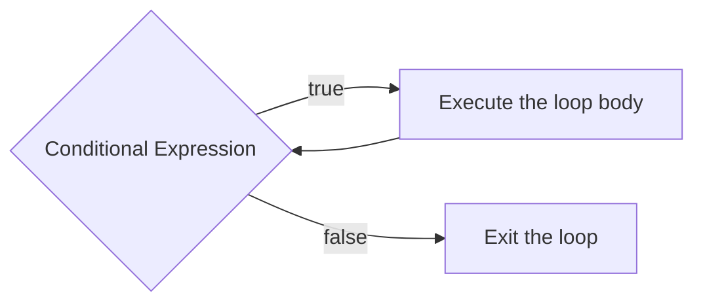
The syntax in the C programming language is⬇️

```c
while(Conditional Expression){
	// Loop Body
}
```
Example 2: Print all even numbers from 1 to 10⬇️

```c
int i = 1;
while(i <= 10){
	if(i %2 == 0){
		printf("%d",i);
	}
	i++;
}
```
⚠️If the initial value of the conditional expression is false, the loop body will not be executed even once.

###  1.3.3 do-while loop

The do-while loop is a type of loop where the loop body is executed first, followed by the judgment of the loop condition. Its execution logic is as follows:

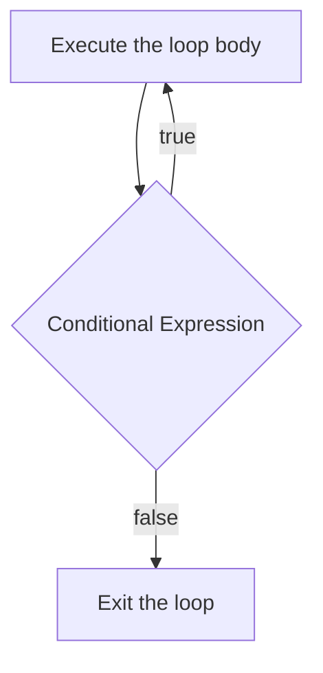
The syntax in the C programming language is as follows ⬇️

```c
do{
	// Loop Body
}while(Conditional Expression);
```
Example 3: Print numbers from 1 to 5⬇️

```c
int num = 1;
do {
	printf("%d",num);
	i++;
}while(i <= 5);
```

###  1.3.4 Termination and Skipping of Loops

Skipping is not only possible in selection structures, but also in loop structures.

In loop structures, the execution flow can be controlled using the break and continue statements:

 - break statement: exits the current loop (in the case of nested loops, it only exits the current layer).
```c
for(int i = 1; ; i++){
	if(i % 5 == 0 && i % 7 == 0){
		printf("The least common multiple (LCM) of 5 and 7 is %d\n",i);
		// the first number that is divisible by both 5 and 7
		break;
		// jump out of the loop immediately after finding it
	}
}
```
Example 4: Find the least common multiple (LCM) of 5 and 7⬆️

 - continue statement: skips the remaining code in the current loop and directly proceeds to the conditional judgment of the next loop.

```c
for(int i = 1; i <= 10; i++){
	if(i % 2 == 0){
		continue; // proceed directly to the next loop.
	}
	// odd numbers will be printed
	printf("%d",i);
}
```
Example 5: Print the odd numbers from 1 to 10 (skip the even numbers)⬆️

#  2. A Brief Introduction to Flowcharts

For the introduction to flowcharts here, those with basic knowledge or prior learning experience can skip this section.

When we learn about complex programs later, flowcharts can better help us understand the process and sequence of program execution.

 - Rectangle
Operation/Processing Box: generally indicates specific operation steps
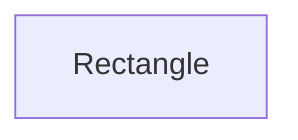
 - Diamond
 Decision Box: indicates a node where a conditional judgment is required, and it usually leads to a "Yes/No" branch, as follows.
 
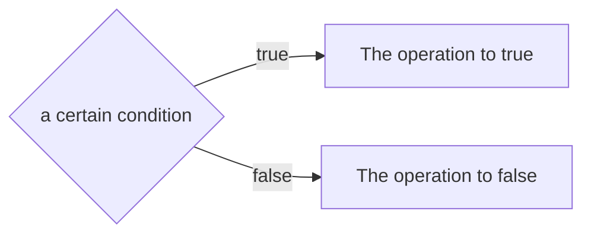
 - Arrow
Process Connecting Line: It indicates the execution order and direction of a process, pointing from one node to another, as shown in the figure below⬇️

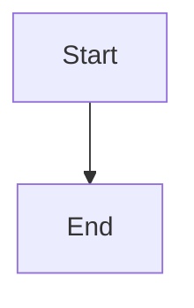

 - Parallelogram (Standard Flowchart)
Input/Output Box: indicates the data or documents that need to be input or output.
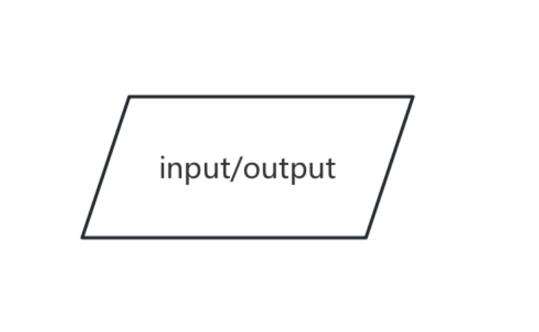

In Mermaid, this is represented by a rounded rectangle.

 ```mermaid
graph LR
A[Start] --> B(Input Data)
```
 - Oval
Start/End Box: indicates the starting point or ending point of a process.


#  3. Other
##  3.1 References/Sources for This Article

 - Source: Flowchart created in WPS, made by myself

This piece of content is quite extensive, so it can be regarded as a combination of two parts.

The complete code with annotated examples will be located in the "exercise" file under the root directory, and its naming will follow the format: [section number of this chapter] + [example serial number] + [abbreviation].
