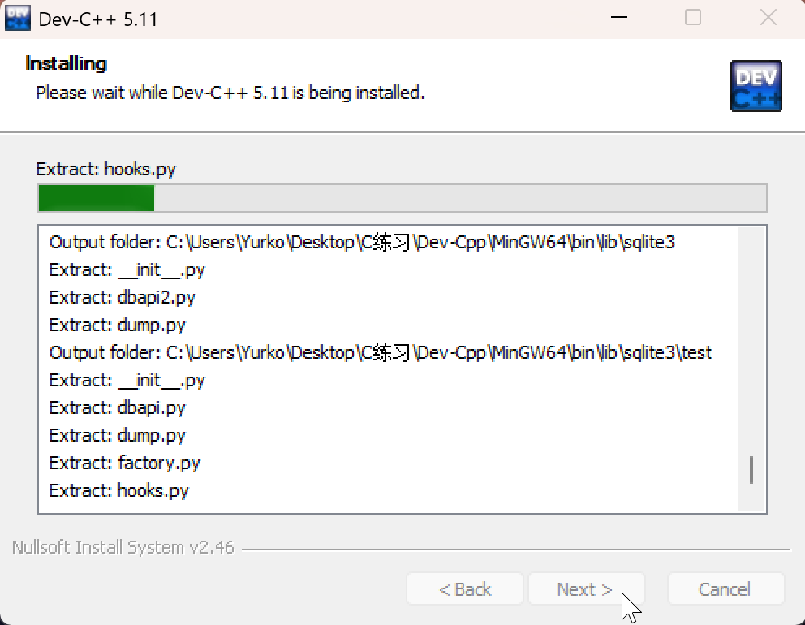

[toc]

# 1. 搭配开发环境💻

学习C语言的第一步是搭建能够 *编写、编译、运行* C语言的开发环境，这是开展后续学习的基础。
>·编写：使用文本编辑器[^1]并且按照 C 语言的语法规则[^2]输入代码，创建以 .c 为后缀的源文件[^3]，这是一个将逻辑转化为代码的过程.
>·编译：通过编译器[^4]将 C 语言源文件转换为计算机能直接执行的机器码（目标文件[^5]）的过程.
>·运行：执行编译生成的可执行文件[^6]，让程序在计算机中实际执行并输出结果，运行过程是程序逻辑的最终体现.

下面我会介绍Windows/Mac系统的环境如何搭建，请根据自己的系统选择相应的部分进行阅读📖。

_选择这两者的原因是，这是新手购买的主要电脑系统。_

[^1]: 用于编写、修改文本内容的工具
[^2]: C 语言规定的代码编写规范与逻辑约束
[^3]: 以.c为后缀的文本文件，如test.c
[^4]: 人类可读的 C 语言源文件（文本格式）转换为计算机可识别的机器码（二进制格式）的工具如 GCC、Clang 等，通俗来说就是进行翻译
[^5]: 又称二进制文件，是编译器生成的、包含机器码（0 和 1 组成的指令）的文件，==计算机能够直接执行的只有二进制文件==
[^6]: 可在操作系统中直接运行的文件，Windows 系统中以.exe为后缀（如test.exe），Linux/Mac 系统中无固定后缀

## 1.1 有关Windows系统的开发环境

推荐使用DEV C++，因为它安装简单、界面直观。十分适合作为新手编写C/C++的开发环境✅

### 1.1.1 Windows系统开发环境的安装步骤

以下是步骤
 1.  点击此链接[DEV C++]()进入到新的网址。
 2.  点击界面中绿色的“Download”按键（点击我用红框圈住的部分）

 3.  等待几秒的时间，你的浏览器右上角会出现如这样的下载弹窗⬇️（如果没有看到，请点击我用红圈圈住的地方）

 4.  下载完成后，点击文件夹📁的图标

 5. 鼠标🖱️右击，选择以管理员身份运行

 6. 同意这个操作（点击“是”按钮）

 7. 等待下载完成后，出现第二张图片的窗口，点击“OK”按钮

 8. 这是软件安装许可协议界面，点击下方的“I Agree”按钮

 9. 根据默认的就行了，点击“Next”按钮

 10. 到了这步是安装路径的选择，默认安装路径在C盘（如果需要安装到其他地方，点击红框中“Browse”按钮选择安装路径），点击“Install”按钮进行安装

 11. 等待进度条安装结束后，点击“Finish”按钮

 12. 这一步是选择界面语言的模块，确认无误后点击“Next”按钮

 13. 这一步是选择界面的样式，也就是外观，选择默认即可，点击“Next”按钮

 14. 等待出现这个界面，便是安装已经完成✅，恭喜你完成了Windows下的环境配置🎉

### 1.1.2 问题补充

欢迎在评论区补充遇到的问题，后续我会补充在这里。

#### 1.1.2.1 手快选择了其他语言/界面看不懂/乱码

 1. 问题一般出现在上述第12步，在界面中选择“TOOLS”（倒数第四个，红圈位置），点击“Environment Options”（弹窗中从上到下第二个）

 2. 打开后的右侧第三个Language（看不懂的直接数右侧第三个）中选择你的语言，选择完成后点击下方的“OK”按钮，整个界面就会更新成你的语言

如果上述方法无法解决，卸载程序后重新按步骤安装便可。

## 1.2 有关Mac OS系统的开发环境

虽然苹果有专门的IDE（Integrated Development Environment）[^7]也就是Xcode，但我并不推荐使用这款软件进行开发，这个更适合用于开发基于Mac系统的软件。
[^7]: 集成开发环境，是一种软件应用程序，它为开发者提供了一个统一的开发环境，涵盖了代码编写、编译、调试、测试等一系列开发流程所需的功能

这里我为初学者推荐使用的是VSCode（Visual Studio Code），安装的体积较小，并且搭载丰富的插件库✅

### 1.2.1 Mac系统开发环境的安装步骤

以下是步骤
 1.  点击此链接[VSCode](https://code.visualstudio.com)进入到新的网址。一开始会有个关于Cookie的，选择“Accept”就可以了。
 2. 点击界面中白色的“Download for macOS”按键（点击我用红框圈住的部分）

 3. 等待浏览器下载，下载完成后双击安装包

 4. 下载完成后，系统会弹出是否打开，选择打开即可

 5. 这是软件的下载，下面还有补充（可跳过步骤6）

 6. 点开Finder，将下载中的软件移动到应用程序中（移动到红框部分）

 7. 打开软件，点击左侧最后一个扩展，搜索"@category:debuggers C"，选择第一个，点击install，这是为VS Code 添加 C/C++ 语言的开发支持

 8. 下载完成后便是这样的页面，恭喜你完成了Mac下的环境配置🎉

 
### 1.2.2 问题补充

#### 1.2.2.1 界面非母语/界面英文

由于VSCode默认是英文，所以如果需要其他语言的界面，则需要安装其他语言的拓展（这里以中文作例子）

 1. 在扩展中搜索🔍chinese，选择第一个，点击install

 2. 下载完成后右下角会弹出如下图所示的窗口，点击按钮，随后软件会重启，重启结束后就是中文的界面

### 1.2.3 关于VS Code插件推荐（可跳）
 
 - C/C++ Extension Pack（微软推出的开发扩展包）和C/C++ Themes（提供UI主题）

 
 这里推荐几个我常用的，这样看代码舒服一些，主要用于外观⬇️
 - indent-rainbow（能够直观的看到换行）

 - Bracket Pair Color DLW(在复杂程序中有助于区分不同的括号，划分层次)

评论区也可以补充一些在编写C语言程序中常用的扩展🧩

# 2. C语言的起源

C 语言由Dennis Ritchie于 20 世纪 70 年代在贝尔实验室（Bell Laboratory）开发。

它是在B 语言[^8]的基础上发展而来，最初的设计目标是用于开发UNIX 操作系统[^9]。
[^8]:贝尔实验室员工Kenneth Lane Thompson以 BCPL（基本组合程序设计语言）为基础，于 1970 年设计出来的一种高级语言。
[^9]:一种多用户、多任务的计算机操作系统，最初由贝尔实验室开发。

在 C 语言出现之前，系统级编程多依赖汇编语言，*开发效率低且可移植性差。* 

> ·开发效率：指完成特定功能代码编写、调试、维护的速度与质量
> ·可移植性高：指在不同操作系统（如 Windows、Linux、macOS）或硬件架构（如 x86、ARM）上，无需或仅需少量修改即可正常运行

丹尼斯・里奇在开发 C 语言时，兼顾了表达能力和执行效率，使 C 语言既能直接操作硬件资源（如内存），又能在不同计算机架构间相对容易地移植。

# 3. C语言的作用和应用范围

## 3.1 作用

C 语言是一种贴近底层的编程语言[^10]，具备以下关键作用：
[^10]:编程语言是用于人与计算机之间进行通信的工具，它定义了一套规则和语法，用于编写计算机能够理解和执行的指令。第一代机器语言，第二代汇编语言，第三代高级语言，C语言属于第三代。

 - 直接操作硬件：可直接访问内存地址、操作寄存器，能高效控制计算机硬件资源。
 - 执行效率高：编译生成的机器码接近汇编语言的执行效率，适合对性能要求苛刻的场景（如游戏引擎、数据库内核）。
 - 为以后学习其他语言奠定基础，为数据结构的学习奠定基础。

## 3.2 应用范围

学习C语言之后我们可以用来做什么❓
 - 游戏开发：游戏引擎（如 Unity 的底层渲染模块、UE的核心逻辑）大量使用 C 语言提升性能🎮🔝
 -  工业软件：自动化生产线的控制软件、航空航天领域的嵌入式程序等，因对可靠性和性能的严格要求，常采用 C 语言开发。
 -  嵌入式系统：智能手表⌚️、智能家居设备、工业控制设备（如 PLC）的固件开发依赖 C 语言。
 - 操作系统开发：UNIX、Linux、Windows 内核的核心模块大量使用 C 语言编写。
 - 数据库与中间件：MySQL 数据库📊、Redis 缓存系统的核心模块用 C 语言实现，保障了数据处理的高性能。
 - 驱动程序：显卡、声卡、网卡等硬件的驱动程序多由 C 语言开发，因为它能直接与硬件寄存器交互。

所以C语言在我们日常生活中十分的常见，学习C语言的过程中我们也会伴随着一些项目的实践，知行合一。

***C语言是一门实践和理论并行的课程。***

# 4. 其他

## 4.1 关于本书的知识框架

以后的每一章节都和这篇的结构一样，不过在学习的过程中，我会尽可能的用图文共同阐述问题。

数学基础和逻辑基础不太好的也不用担心，我会在每篇都补充相关联的数学知识点和逻辑概念。

一些专有名词我也会进行补充说明，如有一些词语不认识也可以在评论区提出。

目前还在更新中，每周两篇，我会积极在评论区回复相关问题。

这是一篇完全零基础可以上手入门的C语言学习课程。

## 4.2 学习的心态

无论你（读者）是怀着怎样的心情和目的去学习C语言的，为了工作也好，为了考试也好，亦或者出于兴趣。我希望大家都能够学到知识，我始终坚信：

>  __科技始终服务于人类__

无论是什么语言，什么新高科技产品，这些通通都是服务于人类的。这些都是人类的工具。

所以，*请在学习的时候,不要感到过分的无措或者迷茫。* 这些是人类智慧的产物。一时的不理解也没关系，毕竟不是所有人一开始摸到汽车就会开车🚗。

人类的精神、意志还有创造力是无穷无尽的∞。我无法用我贫瘠的想象力去判断人类的未来会是怎样，世界的未来会是怎样的。但科技的发展必然服务于人类。

## 4.3 本篇参考/来源

 -  Stephen Prata. C Primer Plus（6版）[M].
 - 图片均来自于本人电脑截屏
