# 目录
- [1. 运算符](#1-运算符)
  - [1.1 算数运算符](#11-算数运算符)
    - [1.1.1 除法运算中的整数运算](#111-除法运算中的整数运算)
    - [1.1.2 除法运算中的浮点数（小数）运算](#112-除法运算中的浮点数小数运算)
  - [1.2 关系运算符](#12-关系运算符)
  - [1.3 逻辑运算符](#13-逻辑运算符)
    - [1.3.1 逻辑与（AND）](#131-逻辑与and)
    - [1.3.2 逻辑或（OR）](#132-逻辑或or)
    - [1.3.3 逻辑非（NOT）](#133-逻辑非not)
    - [1.3.4 逻辑运算符的优先级和结合性](#134-逻辑运算符的优先级和结合性)
- [2. C语言编程的基本策略](#2-c语言编程的基本策略)
  - [2.1 有关C程序运行的过程](#21-有关c程序运行的过程)
  - [2.2 第一个C语言程序](#22-第一个c语言程序)
    - [2.2.1 HelloWorld!](#221-helloworld)
    - [2.2.2 如何在Window上运行](#222-如何在window上运行)
    - [2.2.3 如何在Mac上运行](#223-如何在mac上运行)
- [3. 其他](#3-其他)
  - [3.1 本篇参考/来源](#31-本篇参考来源)

# 1. 运算符

运算符是C语言中实现数据操作的基本语法元素，按功能可以分为算数、关系和逻辑三类。

##  1.1 算数运算符

算数运算符用于数值计算，包括一下几种⬇️

| 算数运算符 | 数学含义 |
|--|--|
| + | 加法，用于计算相加的结果 |
| - | 减法，用于计算相减的结果 |
| * | 乘法，用于计算相乘的结果 |
| / | 除法，用于计算相除的结果 |
| % | 取余，用于计算除后的余数 |

请注意以几点：

 - ➗除法运算中，若操作数均为整数，结果为整数（去掉小数部分）；若包含浮点类型的操作数，结果为浮点型。
 > ·操作数：参与运算的量，是运算符作用的对象。

### 1.1.1 除法运算中的整数运算

一共有5个苹果，2个孩子，怎么分才能公平呢？（苹果不能切着分给孩子们）


我们进行一个简单的除法计算，当然这里口算也可以知道，当然是一个孩子得到两个苹果🍎
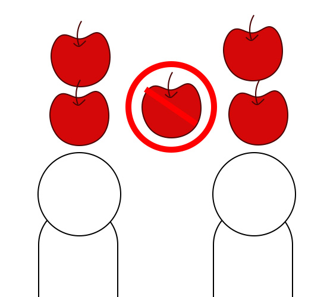

```c
int apples = 5,kids=2,each;
each = apples/kids;	
//这里each的结果是2
```
如果用C语言代码来表示就是这样写的⬆️

 ### 1.1.2 除法运算中的浮点数（小数）运算
 
这里我们有一整块的披萨，我们要分给上面两个小朋友，但此刻，我们带了刀🔪（浮点数，可以有小数的出现）。
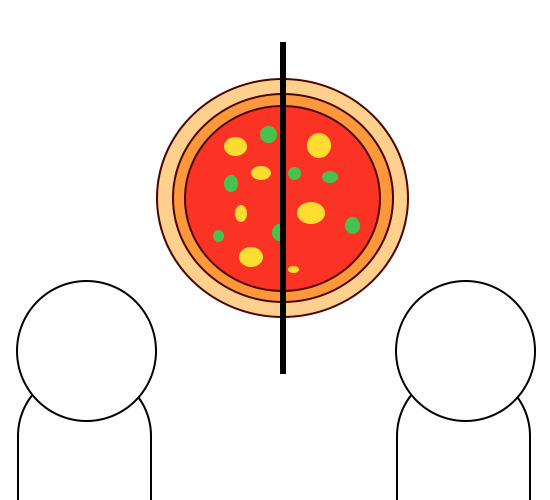

所以，每个小朋友可以分得一半的披萨，也就是0.5份的披萨🍕

```c
float pizza = 1.0,each;
each = pizza/kids;
//这里的结果是一个浮点数0.5
```
如果用C语言代码来表示就是这样写的⬆️

 - 取余运算仅适用于整数，结果符号与被除数一致。
 
回到我们上面分苹果🍎的例子，4个苹果被孩子们分完了，那么剩下来的只有一个苹果。

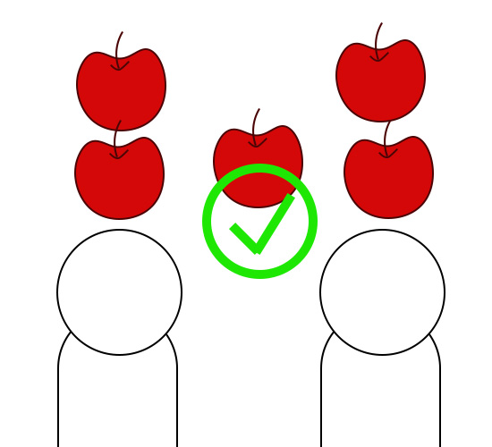

```c
int apples = 5,kids=2,remain;
remain = apples%kids;
//这里c的结果是1
```
用C语言代码来表示就是这样写的⬆️

*我这里的变量名称看着有些复杂，这里的变量名替换成a、b、c是一样的效果，能够理解就可以！*

加法，减法，乘法是差不多的用法，将其中的运算符替换成对应的就可以了。 

##  1.2 关系运算符

关系运算符用于比较操作数之间的关系。

对于关系的判断，我们有两种结果，真（成立）和假（不成立）。

在C语言中，我们对于这种关系判断的结果返回布尔值来表示关系的true（1）false（0）。

关系运算符包括以下六种⬇️

| 关系运算符 | 例子 | 说明 |
|--|--|--|
| == |  a==b | a与b相等时返回true，否则返回false |
| != |  a!=b | a与b不等时返回true，否则返回false |
| > | a>b | a大于b时返回true，否则返回false |
| < | a<b | a小于b时返回true，否则返回false |
| >= | a>=b | a大于等于b时返回true，否则返回false |
| <= | a<=b | a小于等于b时返回true，否则返回false |

值得注意的是，==既可以用于基本数据类型还可以用于引用数据类型

> ·引用数据类型：类型的实际值引用表示的数据类型，后面学习到这部分的时候会讲

##  1.3 逻辑运算符

逻辑运算符用于执行基本的逻辑运算。

逻辑运算符对布尔值（真/假）进行组合或修饰。它们以表达式的真假作为操作数，最终返回一个布尔值。

| 逻辑运算符 | 格式 | 说明 |
|--|--|--|
| &&（逻辑与） |  表达式A && 表达式B | 当两个表达式的结果都为真时，整体结果为真；否则为假 |
| ｜｜（逻辑或） | 表达式A｜｜表达式B | 只要表达式A或表达式B中一个为真时，整体结果为真；只有两个表达式都为假时，整体结果为假 |
| ! （逻辑非）| !表达式A | 对表达式A的结果取反—若A为真，则结果为假；若A为假，则结果为真 |

⚠️这里的或应该是||，这里只是为了更直观的显示。

###  1.3.1 逻辑与（AND）

```c
int a = 5, b = 10;
int result1 = (a > 0) && (b < 20); // 真
int result2 = (a > 10) && (b < 20); // 假
```
 - 在result1中：

a的值是5，满足 a>0 这个表达式，所以左侧表达式的结果为真；b的值是10，满足 b<20 这个表达式，所以右侧表达式的结果为真。

在逻辑与中，两侧表达式的结果都为真时，整体结果为真。

 - 在result2中：

a的值是5，不满足 a>10 这个表达式，所以左侧表达式的结果为假；b的值是10，满足 b<20 这个表达式，所以右侧表达式的结果为真。

在逻辑与中，左右表达式的结果一真一假，整体的结果为假。

###  1.3.2 逻辑或（OR）

```c
int a = 5, b = 10;
int result1 = (a > 10) || (b < 20); // 真
int result2 = (a > 10) || (b > 20); // 假
```

 - 在result1中：

a的值是5，不满足 a>10 这个表达式，所以左侧表达式的结果为假；b的值是10，满足 b<20 这个表达式，所以右侧表达式的结果为真。

在逻辑或中，左右表达式的结果一真一假，整体的结果为真。

 - 在result2中：

a的值是5，不满足 a>10 这个表达式，所以左侧表达式的结果为假；b的值是10，不满足 b>20 这个表达式，所以右侧表达式的结果为假。

在逻辑或中，左右两侧表达式的结果都为假，整体的结果为假。

###  1.3.3 逻辑非（NOT）

```c
int a = 5;
int result1 = !(a > 10); // 真
int result2 = !(a > 0);  // 假
```
 - 在result1中：

a的值是5，不满足 a>10 这个表达式，a>10表达式的结果为假。

在逻辑非中，需要对表达式的结果取反，所以非a的结果为真。

 - 在result2中：

a的值是5，满足 a>0 这个表达式，a>0表达式的结果为真。

在逻辑非中，需要对表达式的结果取反，所以非a的结果为假。

###  1.3.4 逻辑运算符的优先级和结合性

 - 优先级：逻辑非（!）> 算数运算符 > 关系运算符 > 逻辑与（&&）> 逻辑或（||）。
 - 结合性：除了逻辑非（!）是右结合，逻辑与（&&）和逻辑或（||）都是左结合。
 
#  2. C语言编程的基本策略

前面介绍了那么多的基本语法，那么你是否还有一个问题：

 *C语言究竟是怎么运行的呢❓*

这是个很好的问题，下面我流程图来演示一下：

##  2.1 有关C程序运行的过程

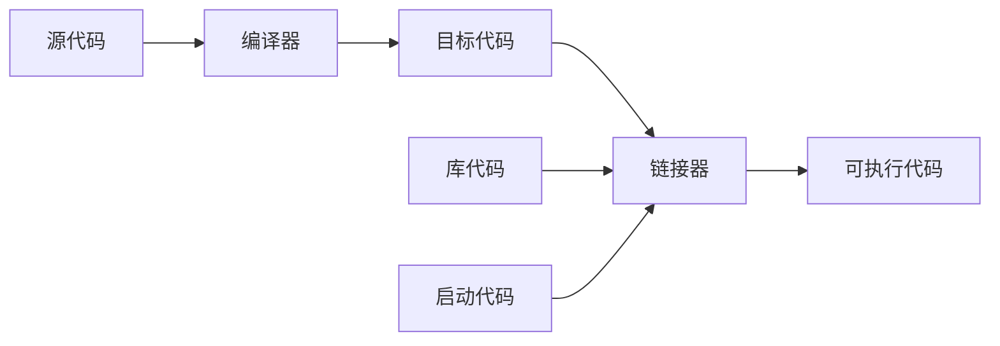

> ·链接器：将多个代码模块整合成一个可执行的完整程序

由上图可以看出：

==对于C语言来说，引入库代码是必须的==

##  2.2 第一个C语言程序

现在我们学习第一个，也是最常用的库，标准输入输出库⬇️

> <stdio.>

这个库中包含输出函数和输入函数以及文件操作函数。

在本节中，我们先学习输出函数最常用的⬇️

> printf('A');

这是个标准的格式，单引号中的内容会输出到屏幕，可以是一串字符，也可以是单个字母/数字。

###  2.2.1 HelloWorld！

在C语言中，最原始最简单的框架是这样的：
```c
#include <stdio.h> 
int main() {        
	// 这里来写你的语句
    return 0;      
}
```

//后的内容是注释内容，在执行程序时不会运行//后的内容	。

 - 第一行是用来引入C语言的标准库，也就是引入“标准输入输出头文件”(stdio.h)
 - 第二行 int main()是程序的入口函数，C语言规定所有程序都要从 main 函数开始执行，大括号{ }中的内容是函数的具体执行的代码
 - return 0 的作用，表示 main 函数执行完毕，返回整数0（表示程序正常结束），非0值表示程序异常结束

*⚠️注意事项：语句末尾的 ; （分号）是语句结束符，很多新手在写代码的时候容易忘记在句末加上分号。*

将我们要写的语句放在我注释的部分，这就是我们的第一个程序💻

```c
#include <stdio.h>  
int main() {        
    printf("Hello, World!"); 
    return 0;      
}
```

###  2.2.2 如何在Window上运行

我的界面是英文，不影响具体的操作，中文界面根据我的步骤来就行✅

 1. 打开DEV C++，单击我圈住的部分，选择Source File（源文件)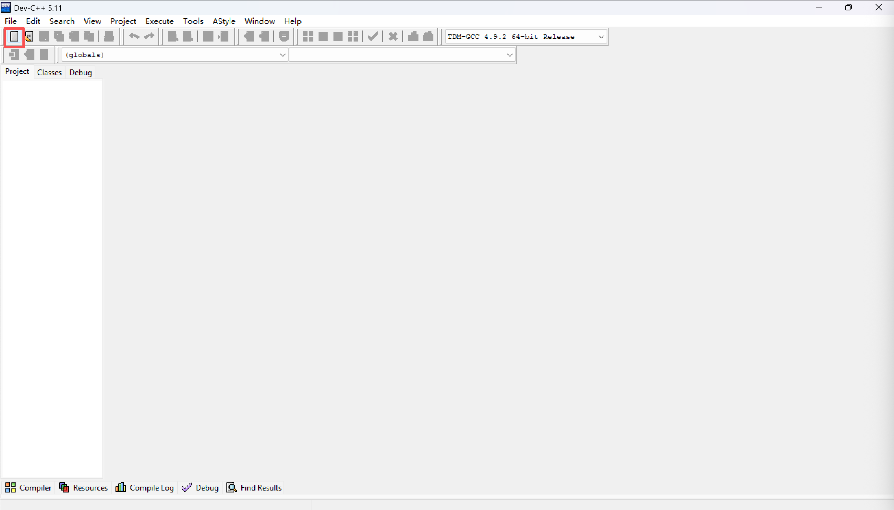
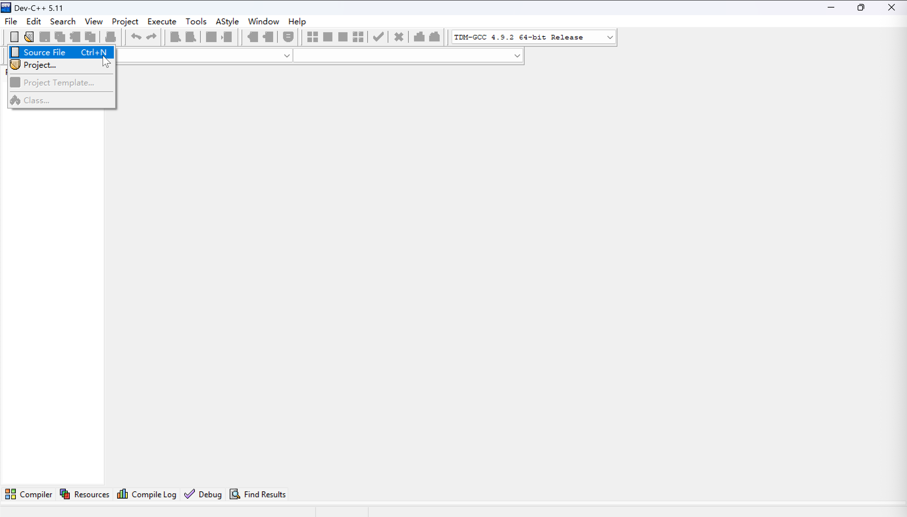

 2. 将上述的代码写到图1的空白处，写好后就像图2一样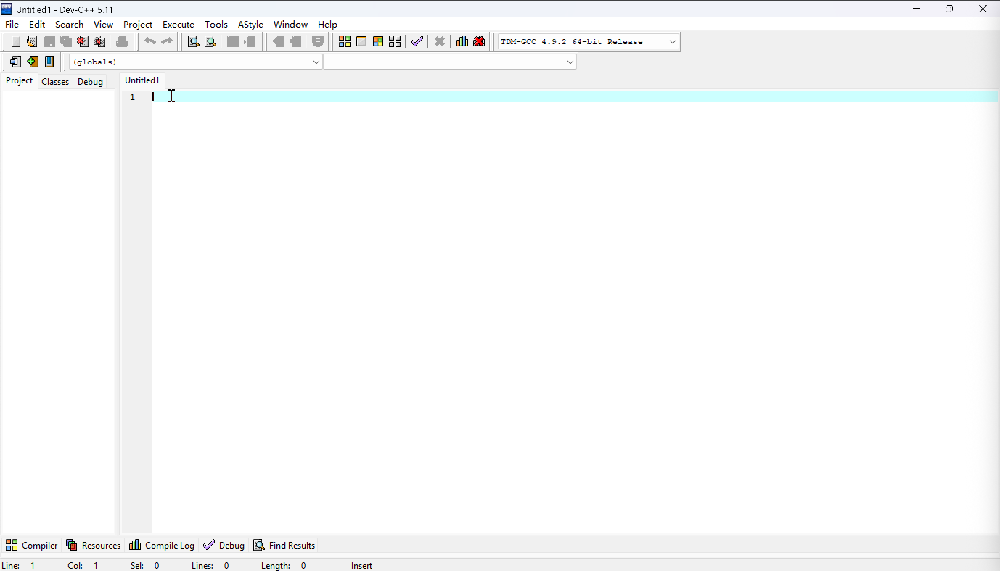
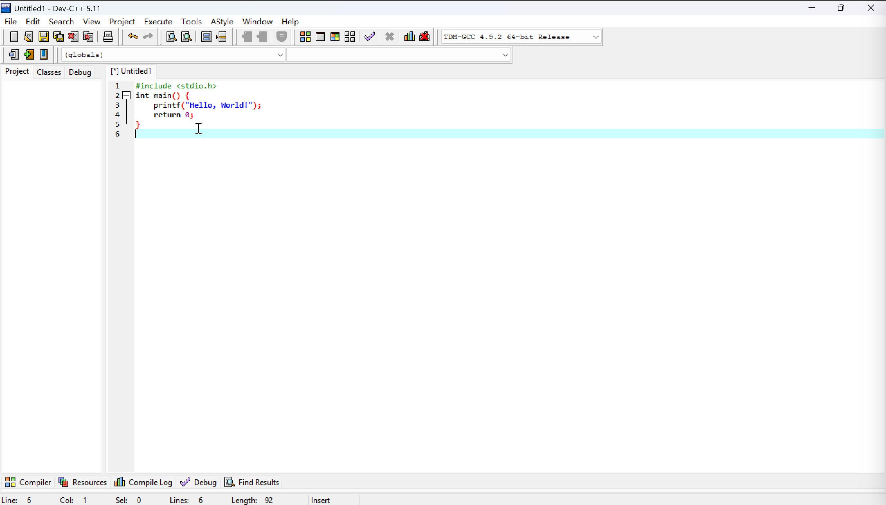

 3. 点击图中画圈的部分（也就是编译运行文件）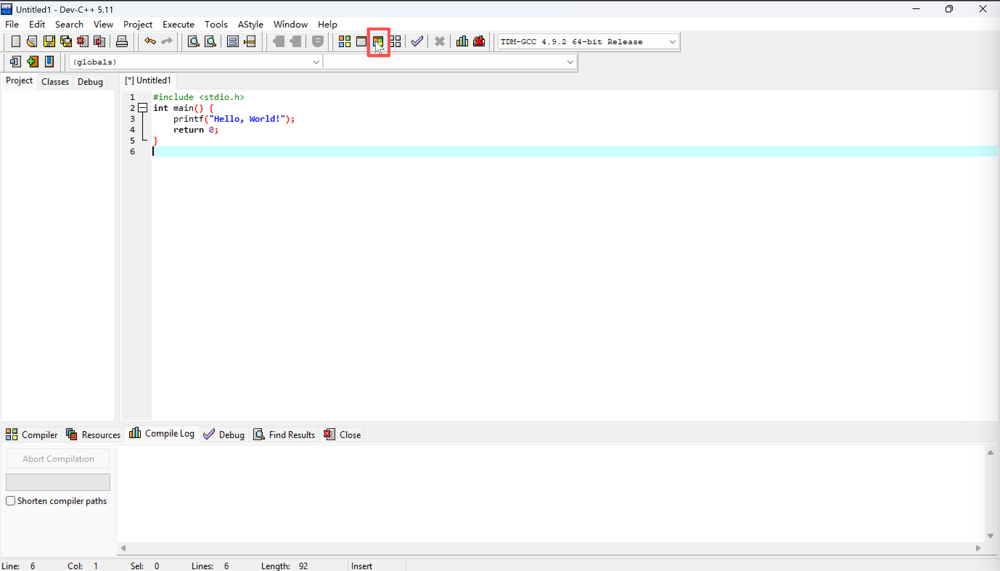

 4. 选择合适的文件存储位置，并且为文件命名（如test），后保存文件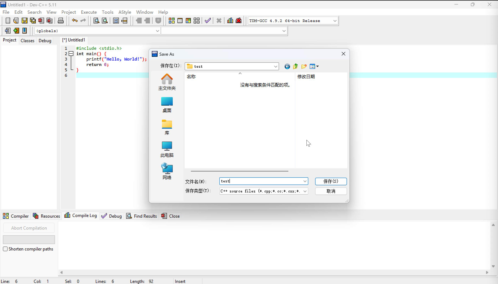

 5. 稍等一会（或再次点击运行按钮），你的终端就会弹出运行后的窗口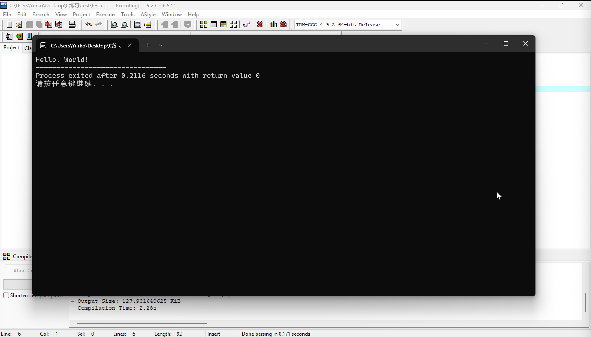

图中的Hello,World! 就是我们写给程序的内容，恭喜你完成了第一个C语言程序🎉

###  2.2.3 如何在Mac上运行

 1. 打开VSCode，新建文件（command+N），或者选择图中的方式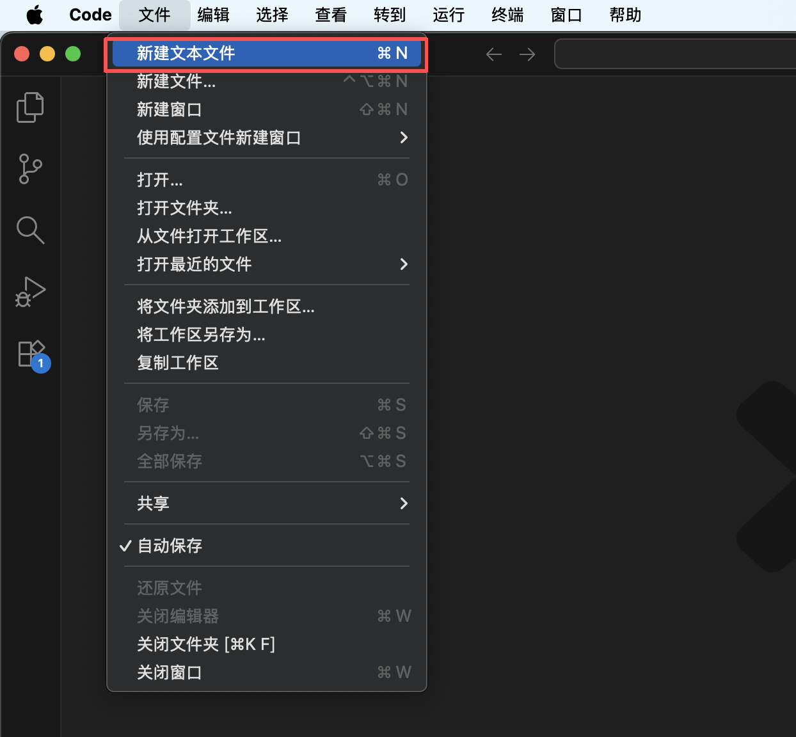

 2. 在新建的文件中，输入上述的代码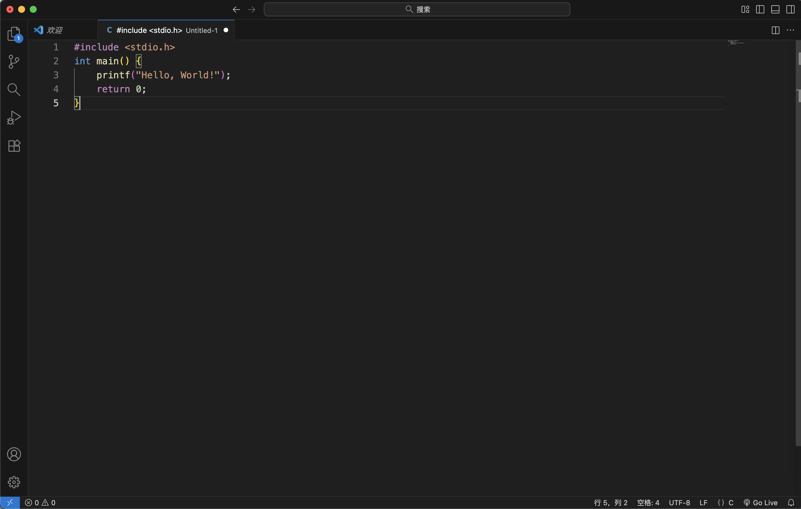

 3. 在键盘上点击F5，或者在导航栏中找到运行（选择如图中所示内容）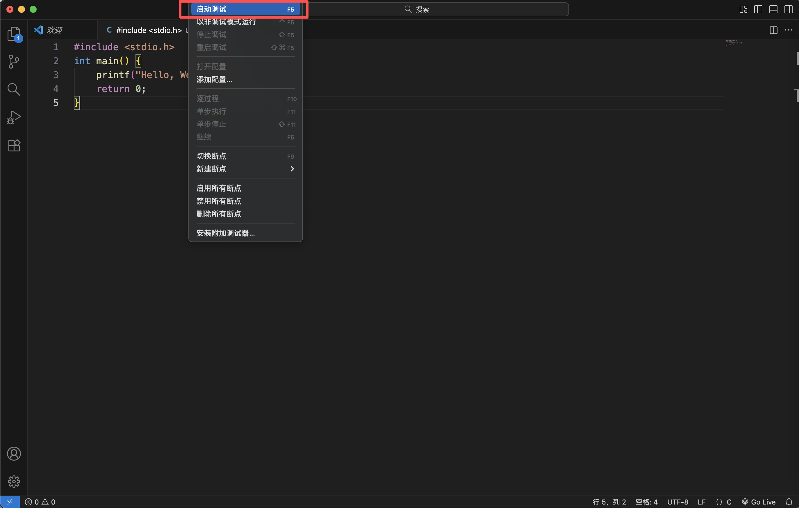

 4. 选择存储路径，命名该文件，并且存储该文件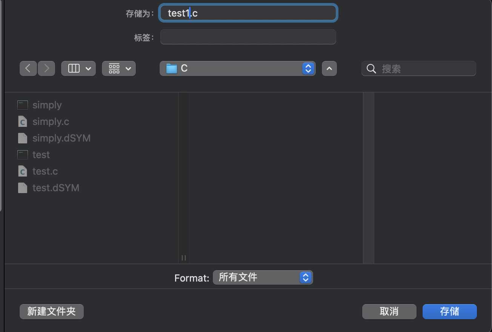

 5. 选择合适的编译器，两者都可以（需要安装我第0篇所说的扩展）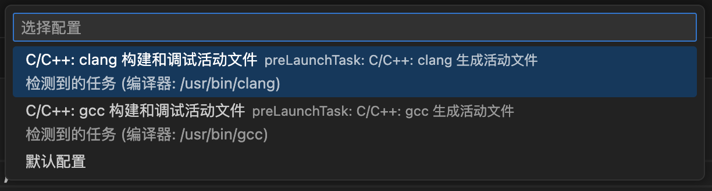

 6. 允许该文件的访问（未必是桌面，允许就可以了）

 7. 在VSCode中，我圈住的部分就是运行的结果，或如果要查看终端中的运行请看步骤八和九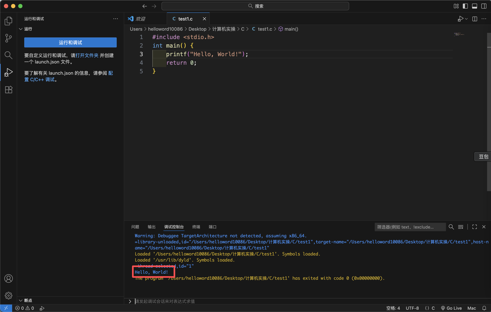

 8. 找到存储文件的那个位置（我将之前的文件删掉了，只剩下现在的）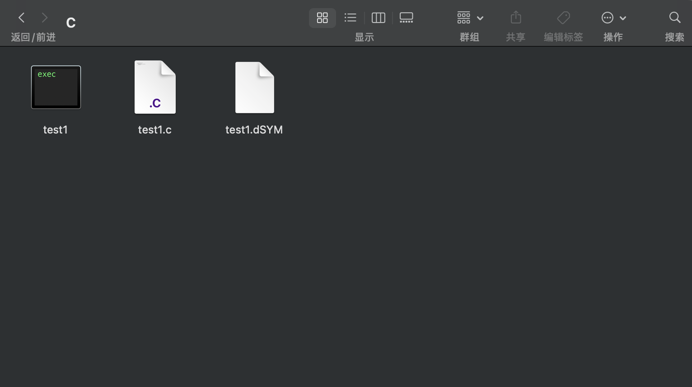

 9. 点击第一个终端图标（如果没有图标，就可能是权限问题，在设置中解决就行了），运行的结果如下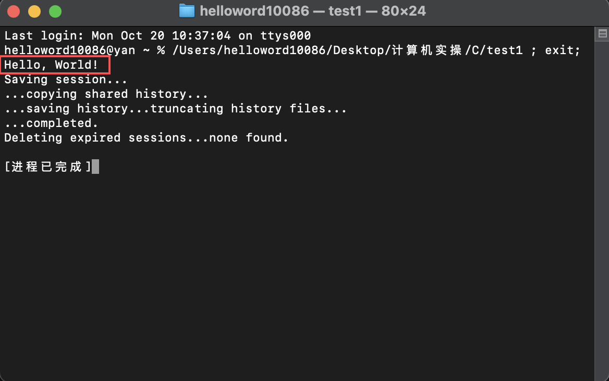

图中的Hello,World! 就是我们写给程序的内容，恭喜你完成了第一个C语言程序🎉

#  3. 其他

##  3.1 本篇参考/来源

 - Stephen Prata. C Primer Plus（第 6 版）中文版 [M]. 姜佑 译. 北京：人民邮电出版社，2019.
 - 图片由本人手绘制作✍️或电脑截屏


