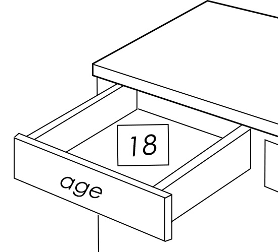
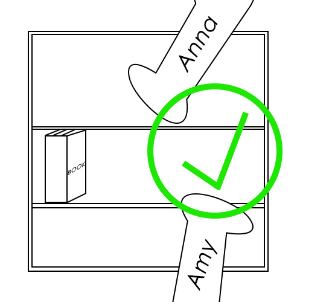

# 目录
- [1. 变量声明](#1-变量声明)
  - [1.1 变量的定义与命名规则](#11-变量的定义与命名规则)
  - [1.2 变量的初始化](#12-变量的初始化)
  - [1.3 变量作用域的基本概念](#13-变量作用域的基本概念)
    - [1.3.1 局部变量](#131-局部变量)
    - [1.3.2 全局变量](#132-全局变量)
- [2. 数据类型](#2-数据类型)
  - [2.1 整型](#21-整型)
  - [2.2 浮点型](#22-浮点型)
  - [2.3 字符型](#23-字符型)
    - [2.3.1 ASCII码](#231-ascii码)
- [3. 其他](#3-其他)
  - [3.1 计算机的存储单位](#31-计算机的存储单位)
    - [3.1.1 最小单位：位（Bit）](#311-最小单位位bit)
    - [3.1.2 基础单位：字节（Byte）](#312-基础单位字节byte)
    - [3.1.3 运算单位：字（Word）](#313-运算单位字word)
  - [3.2 本篇参考/来源](#32-本篇参考来源)

# 1. 变量声明

变量是C语言中存储数据的基本单元。


变量就像是你家收拾的物品的抽屉，每个抽屉（变量）都有名字和类型，用来存不同的东西（数据）📄。

##  1.1 变量的定义与命名规则

变量的定义需要明确指定其类型和名称。

> [类型]	[变量名]

类型就是你存储数据📊的属性。

==所有变量都必须先声明后使用。==

==请注意，在编写C语言一个完整的语句的时候，不要忘记在末尾添加分号（英文输入法中）。==


就像是你在人群中找人，你要先知道一个人的名字，才能找到那个人🗣️

C语言的变量命名需遵循以下规则：

 - 由字母、数字和下划线组成，且必须以字母或下划线开头；
 - 要区分大小写，如Alice和alice是两个不同的变量；
 - 不能使用C语言的“关键字”作为变量名。

|关键字类型  |一共32个关键字（目前为止）  |
|--|--|
|  数据类型关键字| char、short、int、long、float、double、unsigned、signed、void、struct、union、enum |
|  控制语句关键字|if、else、for、while、do、switch、case、default、break、continue、goto、return |
|  存储类型关键字| auto、register、static、extern、const |
|  其他关键字| sizeof、typedef、volatile |

例如，定义一个存储年龄的整型变量：

```c
int age;
```

上面这行定义了一个名叫age的变量，也就是我们现在有了一个叫age的空抽屉🗃️


##  1.2 变量的初始化

初始化变量就是为变量赋一个初始值。

初始化变量可以直接在声明中完成，只需在变量名后面加上* 赋值运算符（=）*和待赋给变量的值即可。

- 基础赋值运算符=：将右侧表达式的结果存储到左侧变量中，也就是将左边的数值给右侧的变量。

变量初始化的常用方法如下⬇️

```c
int age = 18;
```



也就是在名为age的抽屉中，放了一张写着“18”的字条，既然它是个抽屉了，自然我们这里的数据可以不止是18，还可以是19、20。

但我们放的第一个纸条是数字18，所以变量初始化就是给“抽屉塞的第一个东西”。

上述是简单的单个变量初始化，既然有一个存储物品的空间🏠，那我们可以有很多的空间去存储不同的东西⬇️

```c
int money = 100,save = 200;
```


##  1.3 变量作用域的基本概念

变量的作用域，听上去是个很抽象的概念，实际上变量的作用域可以理解为可见范围👀

就是意味着你能够在哪看到你的“盒子”🗃️

###  1.3.1 局部变量

上述我们在名为age的抽屉里放了“18”字条，抽屉的位置是在卧室。那么我们的作用域就是在卧室🛏️。

这种就称为局部变量，只有在特定区域可以使用的变量。

局部变量是在程序某个范围内可以使用，但超过这个范围便不可以使用，因为整个变量只作用在该范围内。


> 这是Alice的储物箱，Anna不能使用

在班级中，每个人都有自己的储物箱，那这个储物箱（变量）的所属权（作用域）是该学生而不是其他同学。

###  1.3.2 全局变量

与局部变量相对的就是全局变量。



> 这是班级公共的书架，所以Amy和Anna可以借阅

还是在班级中，班级的公共图书架📖是班级内所有都可以拿来借阅的，也就是在整个班级（程序）当中，任何人都可以对公共图书（全局变量）进行访问。

全局变量就是整个程序范围内都可以访问的变量。

在以后的程序练习中，我们会详细的介绍这两者的区别和使用，这里作为基础概念进行讲解。

# 2. 数据类型

C语言会把数据分成不同的“类型”，就像喜欢收纳物品的人喜欢将物品进行分类放到不同的地方。

数据类型用于存储不同类型的数据，下面是三种基本的数据类型。

##  2.1 整型

整型用于存储整数。

| 整型 | 介绍 |
|--|--|
| int | 基本整型，通常占4个字节 |
| short（或short int） | 短整型，占2个字节 |
| long(或long int） | 长整型，占4个或8个字节 |
| long long（或long long int） | 长长整型，占用8个字节 |

字节是计算机存储和处理数据的基础单位，在本篇3.1中我会进行这方面的介绍。

```c
int a = 10;
```

定义了一个名叫a的基本整型变量，a的值为10。

##  2.2 浮点型

浮点型又称实型，用于存储带小数的数值。

| 浮点型（实型） | 介绍 |
|--|--|
| float | 单精度浮点型，占用4个字节，精度约6-7位有效数字 |
| double | 双精度浮点型，占用8个字节，精度约15-17位有效数字 |

在大多数情况下，使用double可以获得更高的精度，能够让我们所计算的数据更加准确。

```c
double pi = 3.1415926;
```

定义了一个名叫pi的双精度浮点型变量，pi的值为3.1415926。

##  2.3 字符型

字符型char用于存储单个字符，占用1个字节。

它既可以存储单个字符，也可以存储小整数。

```c
char ch = 'A';
char num = 65;	//就是num = 'A';
```

==注意，如果要将A赋值给ch，那么需要加上单引号（英文状态下）。==

*这里的小整数并非是真正的整数，而是ASCII码值，所以这里的65和'A'代表的含义是一样的，都表示大写字母A。*

###  2.3.1 ASCII码

我们来简单的理解一下计算机⬇️

一个灯的状态有两种，开和关。


所以电子元件的状态有两种，开和关，用数字来表示就是0和1，计算机是由许许多多个电子元件组成的。

所以计算机能够直接计算有关0和1 相关的计算，也就是机器能够直接执行。

但是在现在的社会，我们生活中不止有数字，还有字符，还有其他数据，因此美国的标准化组织就出台了ASCII编码，规定了常用符号用哪些二进制数来表示。

由于数制之间是可以互相转换的，二进制可以转换成十进制（我们数学计算中，用的就是十进制），十进制可以同样转换为二进制。

| 十进制 | 二进制 | ASCII 码（字符 / 含义) | 分类说明 |
|--|--|--|--|
|0|00000000|NUL（空字符)|控制字符，用于标识空白|
|8|00001000|BS（退格键)|控制字符，光标左移 1 位|
|9|00001001|TAB（制表符）|控制字符，光标跳格|
|10|00001010|LF（换行键）|控制字符，光标换行|
|13|00001101|CR（回车键）|控制字符，光标回车|
|32|00100000|	（空格字符）|可显示字符，空白间隔|
|48|00110000|0（数字 0）|可显示字符，数字 0-9 起始|
|49|00110001|1（数字 1）|可显示字符，数字系列|	
|...|...	...|（数字 2-9）|十进制 48-57 对应数字 0-9|	
|65|	01000001	|A（大写字母 A）	|可显示字符，大写字母起始|
|66|	01000010|	B（大写字母 B）|	可显示字符，大写字母系列|
|...	|...	...|（大写字母 C-Z）|	十进制 65-90 对应大写 A-Z|
|97|	01100001|	a（小写字母 a）|	可显示字符，小写字母起始|
|98|	01100010|	b（小写字母 b）|	可显示字符，小写字母系列
|...|	...	...|（小写字母 c-z）|	十进制 97-122 对应小写 a-z|
|33|	00100001	|!（感叹号）|	可显示字符，标点符号|
|64|	01000000	|@（@符号）|	可显示字符，特殊符号|
|127|	01111111|	DEL（删除字符）	|控制字符，用于删除操作|

⬆️这就是常见的ASCII码值，下篇我会讲到有关二进制十进制的互相转换和计算，这里作为学习的参考。

# 3. 其他

这里我们只作传统计算机和大众计算机进行说明，不探讨其他。

##  3.1 计算机的存储单位

在上述有关ASCII码的学习当中，我们了解到计算机能够直接理解的就是二进制，也就是电子元件的通路/断路两种状态。

###  3.1.1 最小单位：位（Bit）

计算机中最小的数据单位是“位”，只能表示两种状态：0或1。

在计算过程中，位通常用bit来表示。

在计算机中的所有的数据最终都会被拆解成“0”和“1”的位组合。
###  3.1.2 基础单位：字节（Byte）

字节是计算机中最常用的基础存储单位，1字节一般简写为1B。

字节与位的换算关系是这样的⬇️

1字节=8位。

 *由于字节本身也较小，实际使用中会使用更大的单位，他们的换算关系是1024，也就是2^10^ 。*

- 1KB（千字节） = 1024B
- 1MB（兆字节）= 1024KB
- 1GB（吉字节） = 1024MB
- 1TB（太字节）= 1024GB

###  3.1.3 运算单位：字（Word）

字是计算机一次能处理的数据长度，大小并不固定，取决于计算机的“字长”（如32位机、64位机），1字=字节对应的字节数。

字体现计算机的运算能力，字长越长，计算机一次能处理的数据越多，运算速度通常越快。

举例🌰
- 32位计算机：字长=32位，1字=4字节（32➗8=4），一次能处理4字节的数据📊
- 64位计算机：字长=64位，1字=8字节（64➗8=8），一次能处理8字节的数据📊

##  3.2 本篇参考/来源

 - Kernighan, B., & Ritchie, D. The C Programming Language (第2版)[M].

 - Stephen Prata. C Primer Plus（第 6 版）中文版 [M]. 姜佑 译. 北京：人民邮电出版社，2019.

 - 图片由本人手绘制作✍️
