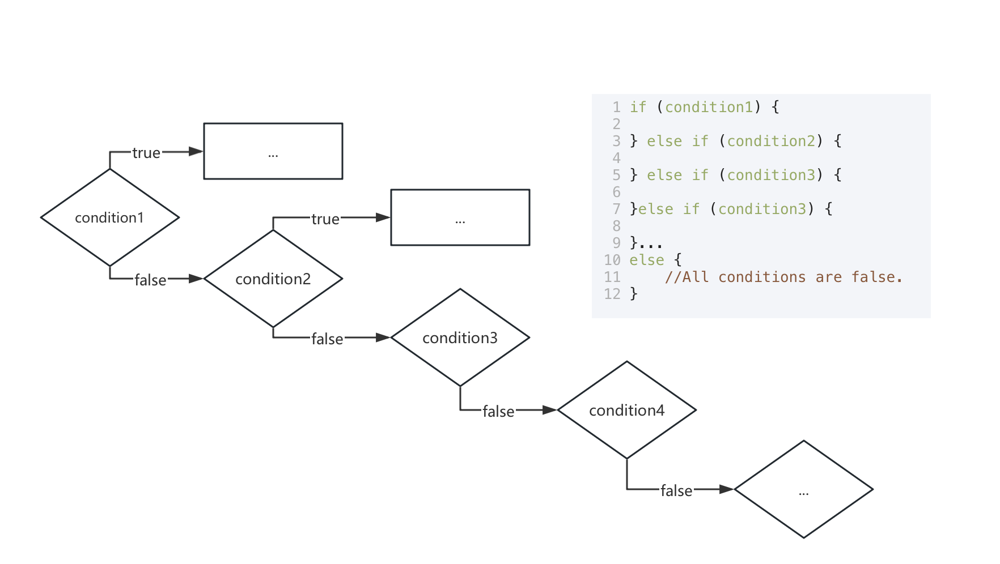
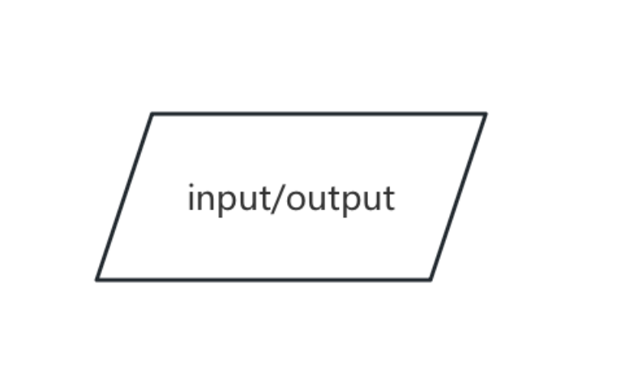
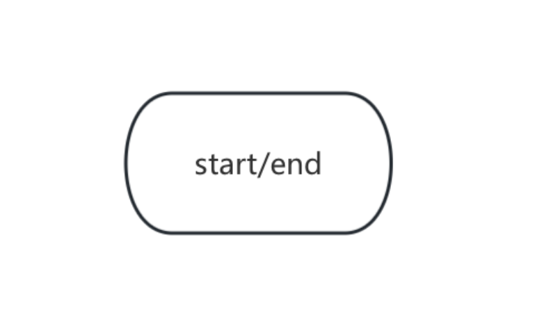

# 目录
- [1. 程序控制结构](#1-程序控制结构)
  - [1.1 顺序结构](#11-顺序结构)
  - [1.2 选择结构](#12-选择结构)
    - [1.2.1 if-else语句](#121-ifelse语句)
    - [1.2.2 switch-case语句](#122-switchcase语句)
  - [1.3 循环结构](#13-循环结构)
    - [1.3.1 for循环](#131-for循环)
    - [1.3.2 while循环](#132-while循环)
    - [1.3.3 do-while循环](#133-dowhile循环)
    - [1.3.4 循环的中断与跳过](#134-循环的中断与跳过)
- [2. 简单认识流程图](#2-简单认识流程图)
- [3. 其他](#3-其他)
  - [3.1 本篇参考/来源](#31-本篇参考来源)

#  1. 程序控制结构

在交通堵塞或者道路繁忙的时候，我们常常能够看到交警在指挥交通🚥

在C语言中，控制结构就承担着“交警”的职责，负责指挥“交通”，也就是指挥程序执行的流程。

C语言的控制结构包括顺序结构、选择结构、循环结构。在下一节我会根据实际的案例进行深入的讲解和学习📑
##  1.1 顺序结构
顺序结构就是按照书写的顺序依次执行的语句。

执行流程：

如，这样一个计算长方形面积⬇️

##  1.2 选择结构

选择结构是基于条件的分支执行。

根据某个条件是否成立，也就是根据某个条件的布尔值（真或假），选择执行不同的分支。
###  1.2.1 if-else语句

 - **单分支 if 语句**
也就是对一个条件进行判断，如果（if）条件成立，就执行对应的代码块，不成立则跳鼓代码块。


*条件表达式可以是变量也可以是一个式子。*

在C语言中的语法为⬇️

```c
if(条件表达式){
	//条件表达式为真时执行的代码块
}
```
在C语言中，是否换行在实际代码中是没有影响的，所以，也可以这样表示⬇️
```c
if(条件表达式){}
```
大括号中的内容就是条件表达式成立时，程序需要执行的语句。

在编写的过程中，选择更合适自己的语法进行书写✍️

如，判断一个学生的成绩是否及格是这样表达的：

```c
int score = 65;
if(score >= 60){
	printf("Passed");
}
```
 - **双分支 if-else 语句**
对一个条件进行判断，如果条件为真（if）则执行真对应的语句，否则（else）就执行假对应的语句。

在C语言中的语法为⬇️

```c
if(条件表达式){
	//条件为真时，所执行的代码
}else{
	//条件为假时，所执行的代码
}
```
对于上述成绩判断的程序，我们进一步的丰富一下✨

```c
int score = 70;
if(score >= 60){
	printf("Passed");
}else{
	printf("Failed");
}
```
 - **多分支 if - else-if - else 语句**
 多分支语句就是对双分支语句进行扩展，使其可以进行三个、四个乃至更多的条件进行判断。


所以，如果是更多的条件，则是这样的

在经历了那么多的条件判断后，else后面的代码块所写的所有条件都不成立的情况。

所以，基本的语法如下所示⬇️
```c
if (条件1) {
    // 条件1为真时执行
} else if (条件2) {
    // 条件2为真时执行
} ...
else {
    // 所有条件为假时执行
}
```
⚠️值得注意的是，在进行 else if 的时候，是在对前面条件不成立的情况下，很多人会忽略这一点，这也是一些人程序返回的结果出错的原因。

我们来对上述成绩判断的程序再进一步的细化（满分为一百分💯）：

```c
int score = 75;
if(score >= 90){
	printf("Excellent");
}else if(score >= 80) {
	printf("Good");
}else if(score >= 60){
	printf("Passed");
}else{
	printf("Failed");
}
```
**补充事项：**

 - 条件表达式必须用括号 ( ) 包裹
 - 如果代码块仅包含一条语句， { } 可以省略不写，但是为了代码的可读性以及代码错误，建议添加
 - 在多分支语句中，如果某一个条件表达式成立，则后续的分支直接进行跳过
###  1.2.2 switch-case语句
switch-case 语句一般用于单个变量的多个离散值进行匹配，switch-case 语句比 if - else 语句更加简洁高效。


也就是说 switch-case 是选择特定值进行特定语句的执行。

其语法如下⬇️

```c
switch(表达式){
	case 常量1;
		//表达式等于常量1时执行的代码
		break; //跳出switch结构
	case 常量2;
		//...
		break;
	...
	default;
		//所有case都不匹配时执行的代码
}
```

break用于“跳出当前的case”，如果省略break，会继续执行下一个case代码，在使用中要根据实际要求选择是否省略。

其实这样在我们现实生活中比较难理解，不过在游戏中可能很好理解了✅

当我们在六人局狼人杀，投票指认凶手时（投票不公开，所以可以投自己），我们可以这样写：

```c
int vote = 4;
switch(vote){
	case 1;
		printf("你投票给了1号");
		break;
	case 2;
		printf("你投票给了2号");
		break;
	case 3;
		printf("你投票给了3号");
		break;
	case 4;
		printf("你投票给了4号");
		break;
	case 5;
		printf("你投票给了5号");
		break;
	case 6;
		printf("你投票给了6号");
		break;
	default:
		printf("你选择跳过本轮，不进行投票");
}
```
**补充事项：**

 - switch 后的表达式必须是整型或字符型（如 int 、 char）
 - case 后的常量必须是“字面常量”，如1、'A'，不允许使用变量
 - default 为可选分支，用于处理所有 case 都不匹配的情况，类似上述的 else

##  1.3 循环结构
简单来说，循环结构就是能够使程序重复执行某段代码🔁，直到满足条件为止。
###  1.3.1 for循环
for循环适用于“已知循环次数”的场景，其执行流程如下图所示：


基础的语法格式为⬇️

```c
for ( 初始化表达式; 条件表达式; 更新表达式){
	// 循环体：需要重复执行的代码
}
```
**复合赋值运算符**

在for循环中，常常会用到复合赋值运算符，这里我来介绍一下复合赋值运算符：
| 复合赋值运算符 | 示例 | 等价于 |
|--|--|--|
| += | a += b | a = a+b |
| -= | a -= b | a = a-b |
| *= | a *= b | a = a*b |
| /= | a /= b | a = a / b |
| %= | a %= b | a = a % b |


**自增、自减**

除了上述的复合赋值运算符，在实际应用中我们常常还会看到自增或自减。

 - 自增 ++ ：使变量的值加1，等价于 变量 = 变量 + 1
 - 自减 -- ：使变量的值减1，等价于 变量 = 变量 - 1

自增和自减可用于前缀也可以用于后缀，其区别在于先变值（后使用）还是后变值（先使用）。
| 形式 | 执行逻辑 |
|--|--|
| ++a / --a | 先对变量执行自增/自减操作，再使用变量的新值参与运算 |
| a++ / a-- | 先使用变量的当前值参与运算，再对变量执行自增/自减操作 |

这里两个概念学习之后，我们能够更好地理解循环♻️

例1: 计算1到100的累加和

```c
int sum = 0;
for (int i = 0; i <= 100; i++){
	sum += i;
}
printf("1到100的和是:%d",sum);
```
这里的 %d 会将 sum 最终的结果以十进制整数形式输出。

**新的知识-占位符**
 - %d
 用于十进制整数的占位符，仅适用于int类型变量，可将指定值或变量以十进制形式进行输入或输出。

除此之外，还有其他常见占位符。

 - %f
用于浮点型变量（如 float 、double 类型），实现浮点数据的格式化输入输出，一般默认输出六位小数，控制具体输出位数为%.2f ，输出两位小数，数字用来指定输出位数。
 - %c
专门用于单个字符的输入输出。
 - %s
用于字符串（一串字符）的输入输出（如，"Hello,World!"）。

**其他用法**

 - 初始化、条件、更新表达式均可省略（但分号不能省略）。例如，实现“无限循环”：

```c
for(;;){
	printf(" I love you\n");
}
```

> 虽然学艺不精，但是浪漫点可以用于表白。适用于非本专业的，因为看不出来难度。
> 这里的 \n 用于换行，下一节我会讲到这部分

 - 支持多个变量同时初始化或更新（用逗号分隔）：

```c
for (int i = 0,j = 10;i<j; i++, j--){
	printf("i = %d, j = %d\n",i,j);
}
```
###  1.3.2  while循环
while循环是一个先判断后执行的循环，当判断条件为真时执行循环体。


在C语言中的语法是⬇️

```c
while(条件表达式){
	// 循环体
}
```
例2：打印1到10的所有偶数

```c
int i = 1;
while(i <= 10){
	if(i %2 == 0){
		printf("%d",i);
	}
	i++;
}
```
⚠️如果条件表达式的初始值为假，循环体一次都不会执行。
###  1.3.3 do-while循环
do-while 循环是先执行循环体再判断的循环，其执行逻辑如下：


在C语言中的语法如下⬇️

```c
do{
	// 循环体
}while(条件表达式);
```
例3: 从1打印到5

```c
int num = 1;
do {
	printf("%d",num);
	i++;
}while(i <= 5);
```
###  1.3.4 循环的中断与跳过
不止在选择结构中可以进行跳过，循环结构总也可以跳过。

在循环结构中，可以通过 break 和 continue 控制执行流程：

 - break 语句：跳出当前循环（如果为嵌套循环，仅跳出当前层）
```c
for(int i = 1; ; i++){
	if(i % 5 == 0 && i % 7 == 0){
		printf("5和7的最小公倍数是：%d\n",i);
		//也就是第一个能被5和7同时整除的数
		break;
		//找到后立即跳出循环
	}
}
```
例4: 寻找5和7的最小公倍数⬆️

 - continue 语句：跳过本次循环的剩余代码，直接进入下一次循环的条件判断。

```c
for(int i = 1; i <= 10; i++){
	if(i % 2 == 0){
		continue; //直接进入下一次循环
	}
	//奇数会被打印
	printf("%d",i);
}
```
例5: 打印1到10中的奇数（跳过偶数）。
#  2. 简单认识流程图
这里对于流程图的介绍，有基础或者学习过的可以跳过本小节。

在后续学到复杂的程序时，流程图可以更好地帮助我们的理解程序执行的过程及顺序。

 - 矩形
操作/处理框，一般表示具体的操作步骤

 - 菱形
 判断/决策框，表示需要进行条件判断的节点，通常引出是否，如下
 

 - 箭头
流程连接线，流程的执行顺序和走向，从一个节点指向另一个节点，如下图所示⬇️


 - 平行四边形（标准流程图）
 输入/输出框，表示需要输入或输入的数据、文档。

这里mermaid中用圆角矩形表示。
 ```mermaid
graph LR
A[开始] --> B(输入数据)
```
 - 椭圆
 开始/结束框，表示流程的起点或终点。


#  3. 其他
##  3.1 本篇参考/来源

 - 图来源WPS中的流程图制作，本人绘制

这篇内容较多，算是二合一。

有标注例题的完整代码会在根目录下exercise文件中，命名以本篇小节数+例题序号+简称
